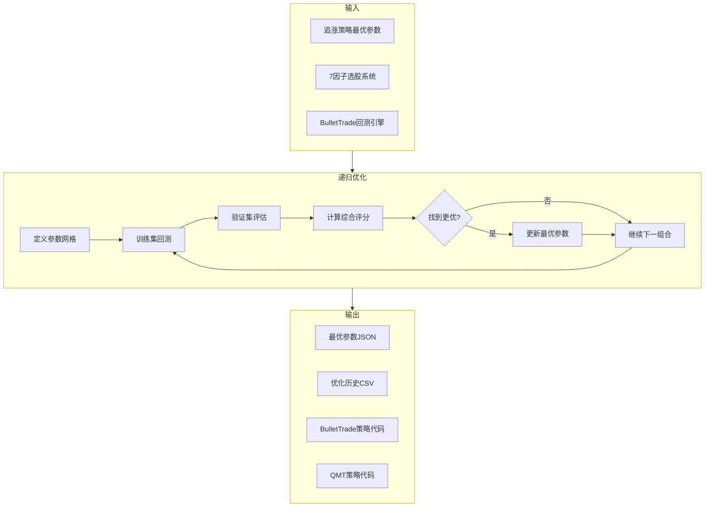

# 牛市极端高收益策略递归迭代优化计划

## 目标

- **收益目标**: 周收益10%+ (激进策略)
- **回测引擎**: BulletTrade (JQData数据源)
- **优化方法**: 网格搜索 + 训练集/验证集分离
- **参考实现**: [scripts/run_chase_rise_optimization_fast.py](scripts/run_chase_rise_optimization_fast.py)

---

## 核心思路

将追涨策略递归迭代优化框架整合到牛市策略中：



---

## Phase 1: 创建牛市策略递归优化框架 (1-2小时)

### 1.1 创建优化脚本

**新文件**: `scripts/run_bull_market_optimization.py`

基于 [scripts/run_chase_rise_optimization_fast.py](scripts/run_chase_rise_optimization_fast.py) 改造：

- 复用 `ProgressReporter` 进度报告器
- 复用 `DataCache` 数据缓存机制
- 复用 `calculate_composite_score()` 综合评分函数
- 复用网格搜索框架 `grid_search_optimize()`

### 1.2 定义策略参数数据类

```python
@dataclass
class BullMarketStrategyParams:
    # 追涨信号参数 (来自优化结果)
    limit_up_threshold: float = 0.093
    vol_ratio_threshold_first: float = 2.5
    mom_5d_threshold_breakout: float = 16.0
    
    # 7因子选股参数 (待优化)
    min_momentum_20d: float = 5.0
    max_momentum_20d: float = 40.0
    max_rel_position: float = 80.0
    max_market_cap: float = 300.0  # 亿
    min_volume_ratio: float = 1.5
    
    # 交易参数
    max_positions: int = 5
    stop_loss_pct: float = -8.0
    take_profit_pct: float = 30.0
    rebalance_days: int = 5
```

### 1.3 参数网格配置

```python
param_grid = {
    # 动量参数
    'min_momentum_20d': [0, 5, 10],
    'max_momentum_20d': [35, 45, 55],
    
    # 相对位置
    'max_rel_position': [70, 80, 90],
    
    # 量比阈值
    'min_volume_ratio': [1.2, 1.5, 2.0],
    
    # 持仓控制
    'max_positions': [3, 5],
}
```

---

## Phase 2: 集成BulletTrade回测引擎 (1-2小时)

### 2.1 创建BulletTrade策略生成函数

复用 [core/advisor_v4/bullettrade_strategy_generator.py](core/advisor_v4/bullettrade_strategy_generator.py)，扩展支持动态参数：

```python
def generate_bull_market_strategy(params: BullMarketStrategyParams) -> str:
    """生成带参数的BulletTrade策略代码"""
    # 融合追涨信号 + 7因子选股
    pass
```

### 2.2 封装回测执行函数

复用 [core/advisor_v4/bullettrade_backtest.py](core/advisor_v4/bullettrade_backtest.py)：

```python
def run_bullettrade_backtest(
    params: BullMarketStrategyParams,
    start_date: str,
    end_date: str,
) -> BacktestResult:
    """执行BulletTrade回测并返回结果"""
    pass
```

---

## Phase 3: 运行递归优化 (30分钟-1小时)

### 3.1 数据集配置

```python
# 训练集 (学习市场特征)
train_periods = [
    ('2019-06-01', '2020-06-30'),  # 牛市上涨期
    ('2024-09-01', '2025-01-10'),  # 最新行情
]

# 验证集 (防止过拟合)
validate_period = ('2020-07-01', '2021-03-31')
```

### 3.2 执行优化

```bash
cd /home/taotao/.cursor/worktrees/TRQuant/ope
./venv/bin/python scripts/run_bull_market_optimization.py
```

### 3.3 输出文件

```
output/bull_market_optimization/
├── best_params_{timestamp}.json       # 最优参数
├── optimization_history_{timestamp}.csv  # 优化历史
└── TRQuant_BullMarket_Optimized_{timestamp}.py  # BulletTrade策略
```

---

## Phase 4: 验证与QMT代码生成 (1小时)

### 4.1 BulletTrade完整回测验证

使用最优参数运行完整回测：

```bash
./venv/bin/python scripts/run_bullettrade_backtest_v4.py \
    --start-date 2024-01-01 \
    --end-date 2025-01-10 \
    --max-stocks 5 \
    --stop-loss -0.08 \
    --take-profit 0.30
```

### 4.2 QMT代码生成

复用 [core/qmt/chase_rise_strategy_generator.py](core/qmt/chase_rise_strategy_generator.py) 模式，生成QMT回测代码：

**输出文件**: `strategies/qmt/TRQuant_BullMarket_Extreme_V1.py`

---

## 关键改进点 (相比原计划)

| 原计划 | 新计划 |

|--------|--------|

| 手动调参 | 网格搜索自动优化 |

| 无进度报告 | 实时进度报告 |

| 无验证集 | 训练集/验证集分离防过拟合 |

| 无数据缓存 | DataCache加速回测 |

| 分离的追涨/因子策略 | 融合追涨信号+7因子选股 |

---

## 预计时间

| 阶段 | 时间 |

|------|------|

| Phase 1: 创建优化框架 | 1-2小时 |

| Phase 2: 集成BulletTrade | 1-2小时 |

| Phase 3: 运行优化 | 30分钟-1小时 |

| Phase 4: 验证与代码生成 | 1小时 |

| **总计** | **4-6小时** |

---

## 核心文件

- **优化脚本模板**: [scripts/run_chase_rise_optimization_fast.py](scripts/run_chase_rise_optimization_fast.py)
- **BulletTrade回测**: [core/advisor_v4/bullettrade_backtest.py](core/advisor_v4/bullettrade_backtest.py)
- **策略生成器**: [core/advisor_v4/bullettrade_strategy_generator.py](core/advisor_v4/bullettrade_strategy_generator.py)
- **追涨最优参数**: [output/chase_rise_optimization/best_params_20260111_161516.json](output/chase_rise_optimization/best_params_20260111_161516.json)