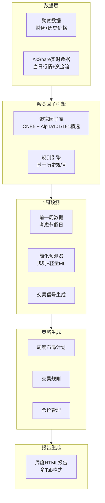

# Investment Advisor V4.0 提前一周布局系统改进计划

## 项目目标

将Investment Advisor V4.0从“T-5预测T”（5个交易日）升级为“按周定义的提前布局系统”（统一以自然周为单位，动态适配节假日），在既有历史研究成果基础上精简因子组合，生成基于规则的策略系统，并输出完整的周度布局与交易策略报告。

## 开发流程约束（必须遵守）

1. **时间口径**：系统中涉及的所有窗口与统计均以“周”为单位，通过`jq.get_trade_days()`动态获取周内交易日，禁止再使用固定“7个交易日”口径。
2. **因子范围**：仅使用我们已经具备的聚宽因子库——CNE5与Alpha101/Alpha191；不引用尚未获取的CNE6或其他外部因子。
3. **历史成果复用**：优先复用`core/factors/jqdata_factor_engine.py`、`research/tenbagger_10x_strategy/knowledge/*.py`、`docs/JQFACTOR_ANALYZER_*.md`等现有成果，不重复开发或大幅改动已验证模块。
4. **小步快跑**：严格按照阶段划分逐步实现，每个阶段都需要独立测试通过后才能进入下一阶段。
5. **MCP工具流程**：每个阶段的实现与验证都要通过标准MCP工具流程（如`workflow9.execute`、`knowledge.add`等）记录与驱动，确保可以重放与审计。
6. **因子挖掘强化**：在现有历史数据仓与知识库的基础上（例如`docs/JQFACTOR_ANALYZER_KB_COMPLETE.md`、`research/tenbagger_10x_strategy/data/`），深化可预测的因子规则，而不是从零开始。

## 系统架构



## 阶段1: 预测窗口调整（按周计算）

### 1.1 修改配置（按周计算）

- **文件**: [`core/advisor_v4/advisor_v4_workflow.py`](core/advisor_v4/advisor_v4_workflow.py)
- **修改**: 
  - `AdvisorV4Config.lookback_days` 改为 `lookback_weeks: int = 1`（1周）
  - 新增方法：`get_trading_days_in_week(date)` - 获取指定日期的周内交易日
- **逻辑**: 
  - 使用`jq.get_trade_days()`获取周内交易日（考虑节假日）
  - 大部分情况是5个交易日，节假日可能是4-5个
  - 使用周的开始和结束日期，而不是固定的交易日数

### 1.2 更新因子提取器（按周）

- **文件**: [`core/advisor_v4/predictor_factor_extractor.py`](core/advisor_v4/predictor_factor_extractor.py)
- **修改**: 
  - `extract_from_historical_cases()` 方法，使用T-1周（前一周）的数据
  - 新增方法：`get_week_start_end(date)` - 获取周的起始和结束日期
  - 使用`jq.get_trade_days()`获取周内实际交易日
- **验证**: 确保历史案例提取逻辑正确处理节假日

### 1.3 更新预测目标（按周）

- **文件**: [`core/advisor_v4/xgboost_predictor.py`](core/advisor_v4/xgboost_predictor.py)
- **修改**: 预测目标从"5日后10%收益"改为"1周后收益"
- **逻辑**: 
  - 使用`jq.get_trade_days()`获取未来1周的交易日
  - 计算未来1周的总收益（考虑节假日，可能是4-7个交易日）
- **选项**: 
  - 方案A: 1周后5%收益（降低难度）
  - 方案B: 1周后涨跌方向（二分类）

👉 **执行要求**：此阶段的设计、实现与测试需通过MCP工具标准流程（如 `workflow9.execute`）记录，并在成功验证后方可进入下一阶段。

## 阶段2: 集成聚宽因子库（简化特征工程）

### 2.1 聚宽因子库集成

- **文件**: 新建 [`core/advisor_v4/jqfactor_calculator.py`](core/advisor_v4/jqfactor_calculator.py)
- **核心API**: `jq.get_factor_values()` - 聚宽官方因子获取接口
- **参考实现**: 
  - [`strategies/tenbagger_comprehensive_strategy.py:calculate_jq_factors()`](strategies/tenbagger_comprehensive_strategy.py)
  - [`core/factors/jqdata_factor_engine.py`](core/factors/jqdata_factor_engine.py)（已实现的因子引擎，需复用而非重写）
- **历史数据复用**: 基于`docs/JQFACTOR_ANALYZER_KB_COMPLETE.md`、`docs/JQFACTOR_ANALYZER_INTEGRATION.md`、`research/tenbagger_10x_strategy/data/`中已有的因子研究与特征库，强化可预测因子的筛选逻辑。

### 2.2 聚宽因子选择（适合A股市场）

#### 2.2.1 CNE5风格因子（权重：30%）

- **因子列表**: `['size', 'beta', 'momentum', 'reversal', 'volatility']`
- **说明**: 聚宽CNE5风格因子，适合A股市场风格分析
- **使用方法**:
  ```python
  values = jq.get_factor_values(
      securities=stocks,
      factors=['size', 'beta', 'momentum', 'reversal', 'volatility'],
      count=1,
      end_date=date
  )
  ```


#### 2.2.2 因子组合说明

- **注意**: 我们只有CNE5和Alpha101/Alpha191因子库
- **不使用**: CNE6风格因子pro（我们没有这个因子库）

#### 2.2.3 Alpha101/Alpha191技术因子（权重：35%，精简选择）

- **可用因子库**: Alpha101 和 Alpha191（我们有这两个因子库）
- **选择原则**: **因子组合不应该过多，只需要适合当下市场的组合**
- **精简策略**:
  - **方案A（快速启动）**: 使用Alpha101/Alpha191中已验证有效的Top 5-10个因子
  - **方案B（市场适配）**: 根据当前市场环境（牛市/熊市/震荡）动态选择适合的因子
  - **因子选择**:
    - Alpha101: 选择alpha_001, alpha_002, alpha_003, alpha_004, alpha_005（前5个）
    - Alpha191: 选择alpha_001, alpha_002, alpha_003, alpha_004, alpha_005（前5个）
    - 或根据历史回测结果选择IC和收益都较好的因子
- **API使用**:
  ```python
  from jqdatasdk.alpha101 import get_all_alpha_101
  from jqdatasdk.alpha191 import get_all_alpha_191
  
  # 获取Alpha101前5个因子
  alpha101 = get_all_alpha_101(
      code=stocks,
      date=date,
      alpha=['alpha_001', 'alpha_002', 'alpha_003', 'alpha_004', 'alpha_005']
  )
  
  # 获取Alpha191前5个因子
  alpha191 = get_all_alpha_191(
      code=stocks,
      date=date,
      alpha=['alpha_001', 'alpha_002', 'alpha_003', 'alpha_004', 'alpha_005']
  )
  ```

- **参考**: 
  - [`docs/jqdata_crawled/alpha101_full.txt`](docs/jqdata_crawled/alpha101_full.txt)
  - [`docs/jqdata_crawled/alpha191_full.txt`](docs/jqdata_crawled/alpha191_full.txt)

#### 2.2.4 因子组合权重（精简版）

- **CNE5风格因子（40%权重）**: 市场风格基础
- **Alpha101/191技术因子（35%权重）**: 技术面确认（精简Top 5-10个）
- **基础财务因子（25%权重）**: ROE, PE, 营收增长, 利润增长（基本面补充）
- **总因子数**: 控制在15-20个以内，避免因子过多导致过拟合

### 2.3 因子计算器实现

- **文件**: 新建 [`core/advisor_v4/jqfactor_calculator.py`](core/advisor_v4/jqfactor_calculator.py)
- **类名**: `JQFactorCalculator`
- **参考实现**: [`strategies/tenbagger_comprehensive_strategy.py:calculate_jq_factors()`](strategies/tenbagger_comprehensive_strategy.py)
- **方法**:
  - `calculate_cne5_factors(stocks, date)` - 计算CNE5因子
    - 使用`jq.get_factor_values()`获取5个CNE5因子
    - 标准化后平均，权重30%
  - `calculate_alpha_factors(stocks, date, top_n=5)` - 计算Alpha101/191因子（精简）
    - 使用`get_all_alpha_101()`和`get_all_alpha_191()`获取Top N因子
    - 方案A: 固定使用前5个因子（alpha_001到alpha_005）
    - 方案B: 根据市场环境动态选择（牛市用动量因子，熊市用反转因子）
    - 标准化后平均，权重35%
  - `calculate_fundamental_factors(stocks, date)` - 计算基础财务因子
    - 使用JQData财务数据（ROE, PE, PB等）
    - 权重25%
  - `calculate_all_factors(stocks, date)` - 综合计算所有因子并加权（精简版）
    - 组合CNE5(40%) + Alpha101/191精选(35%) + 基础财务(25%)
    - 因子总数控制在15-20个以内
    - 输出综合得分（0-100分）

### 2.4 因子标准化和组合（精简版）

- **标准化**: 使用Z-score标准化（`(value - mean) / std`）
- **组合方式**（精简，适合当下市场）: 
  - CNE5: 40%权重（市场风格基础）
  - Alpha101/191（Top 5-10）: 35%权重（技术面确认）
  - 基础财务: 25%权重（基本面补充）
- **因子总数**: 控制在15-20个以内
- **输出**: 综合因子得分（0-100分）

### 2.5 移除复杂特征

- **移除**: 特征流水线、特征选择、特征交互项
- **保留**: 聚宽因子标准化和加权组合
- **优势**: 
  - 使用聚宽官方因子，数据质量有保障
  - 因子已针对A股市场优化
  - 减少自建因子的开发和维护成本

👉 **执行要求**：阶段2所有实现/验证都需通过MCP工具标准流程记录，确保每个子步骤验证通过后再推进。

### 2.6 更新因子计算器

- **文件**: [`core/advisor_v4/multi_factor_calculator.py`](core/advisor_v4/multi_factor_calculator.py)
- **修改**: 
  - 集成`JQFactorCalculator`
  - 简化`calculate_all_factors()`，优先使用聚宽因子
  - 保留基础因子作为备用
- **性能**: 聚宽因子批量获取，提升计算速度

## 阶段3: 规则引擎开发

### 3.1 规则定义

- **文件**: 新建 [`core/advisor_v4/rule_based_strategy.py`](core/advisor_v4/rule_based_strategy.py)
- **规则类型**:
  - **入场规则**（基于聚宽因子）: 
    - CNE6 growth > 0.5 AND earnings_yield > 0.05（成长+估值）
    - CNE5 momentum > 0.3 AND volatility < 0.8（动量+低波动）
    - Alpha191综合得分 > 60（技术因子确认）
    - 基础财务: ROE > 10% AND PE < 30（基本面确认）
  - **出场规则**:
    - 止盈: 收益 >= 10%
    - 止损: 亏损 <= -8%
    - 时间止损: 持有 >= 7天无表现
  - **仓位规则**:
    - 单票仓位: 10-15%
    - 最大持仓: 5-8只
    - 行业分散: 单行业 <= 30%

### 3.2 规则评分

- **方法**: 规则匹配度评分（0-100分）
- **逻辑**: 每个规则有权重，综合得分决定是否入场

### 3.3 规则优化

- **方法**: 基于历史回测结果调整规则阈值
- **工具**: 网格搜索或遗传算法（简化版）

👉 **执行要求**：规则开发和验证通过MCP工具流程跟踪，避免重复实现。

## 阶段4: 回测系统优化（效率优先）

### 4.1 三层回测架构

- **文件**: 直接复用/扩展 [`core/backtest/unified_backtest_manager.py`](core/backtest/unified_backtest_manager.py) 与现有`core/fast_backtest.py`、`core/backtest/backtest_engine.py`能力，禁止重复开发新引擎。
- **架构**:

  1. **快速验证层（Fast）**: < 5秒，向量化回测，用于策略初筛
  2. **标准回测层（Standard）**: < 30秒，事件驱动，用于策略优化
  3. **精确回测层（Precise）**: 完整模拟，用于最终验证

- **渐进式验证**: 快速验证 → 标准回测 → 精确回测

### 4.2 并行回测实现

- **文件**: 新建 [`core/advisor_v4/parallel_backtest.py`](core/advisor_v4/parallel_backtest.py)（封装层），底层复用现有`core/pipeline/backtest_task_manager.py`等组件，避免重复造轮子。
- **并行策略**:
  - 使用`multiprocessing.Pool`或`concurrent.futures.ProcessPoolExecutor`
  - 每个回测任务独立进程，避免GIL限制
  - 使用JQData的3个并发连接，分段并行处理
- **参考**: [`core/advisor_v4/predictor_factor_extractor_parallel.py`](core/advisor_v4/predictor_factor_extractor_parallel.py)

### 4.3 数据库和缓存系统

- **文件**: 参考 [`core/market_trend_storage.py`](core/market_trend_storage.py) 和 [`docs/BACKTEST_RESULT_STORAGE.md`](docs/BACKTEST_RESULT_STORAGE.md)
- **缓存策略**:
  - **MongoDB存储**: 回测结果存储到`jqquant.signal_backtest_results`
  - **缓存键**: `backtest_type + config_hash`（参数哈希）
  - **缓存检查**: 运行前自动检查缓存，存在则直接返回
  - **缓存保存**: 回测完成后自动保存结果
  - **避免重复**: 基于参数哈希的精确匹配
- **数据缓存**:
  - 因子数据缓存：使用本地文件或Redis
  - 价格数据缓存：使用MongoDB或本地文件
  - 缓存过期：根据数据更新频率设置过期时间

### 4.4 快速数据调取

- **文件**: 新建 [`core/advisor_v4/fast_data_loader.py`](core/advisor_v4/fast_data_loader.py)
- **优化策略**:
  - **批量获取**: 使用`jq.get_price()`批量获取多只股票数据
  - **预加载**: 预先加载常用数据到缓存
  - **增量更新**: 只获取新增数据，避免重复
  - **数据索引**: 使用MongoDB索引加速查询
- **参考**: [`core/fast_backtest.py`](core/fast_backtest.py) 中的`DataCache`类

### 4.5 回测流程优化

- **快速验证**: 使用快速回测层，5秒内验证策略逻辑
- **标准回测**: 验证通过后，使用标准回测层进行详细回测
- **精确回测**: 策略优化完成后，使用精确回测层进行最终验证
- **并行处理**: 多个参数组合或股票池并行回测
- **结果复用**: 相同参数的回测结果直接复用，避免重复计算

👉 **执行要求**：阶段4每一子任务都需以MCP工具触发、执行并记录（如`workflow9.execute`），在已有模块基础上扩展，不得重复开发。

## 阶段5: 周度布局计划生成

### 5.1 布局计划结构

- **文件**: 新建 [`core/advisor_v4/weekly_layout_planner.py`](core/advisor_v4/weekly_layout_planner.py)
- **输出**:
  ```python
  @dataclass
  class WeeklyLayoutPlan:
      week_start: str          # 周开始日期
      week_end: str            # 周结束日期
      market_outlook: str      # 市场展望
      position_advice: float   # 建议仓位（0-1）
      
      # 投资标的
      targets: List[LayoutTarget]  # 标的列表
      
      # 交易计划
      entry_plan: Dict[str, EntryPlan]  # 入场计划
      exit_plan: Dict[str, ExitPlan]    # 出场计划
      
      # 风险控制
      risk_controls: List[str]  # 风控措施
  ```


### 5.2 入场计划

- **分批建仓**: 周一50%，周三30%，周五20%
- **价格区间**: 建议买入价格区间
- **触发条件**: 技术指标确认

### 5.3 调仓计划

- **每日检查**: 持仓标的信号变化
- **周中调整**: 根据市场变化调整仓位
- **周末总结**: 本周表现评估

👉 **执行要求**：阶段5需通过MCP工具逐步执行与验证，复用现有`weekly_layout_planner`草稿/Notebook示例，避免重复造轮子。

## 阶段6: 增强推荐功能

### 6.1 扩展recommend()方法（按周）

- **文件**: [`core/advisor_v4/advisor_v4_workflow.py`](core/advisor_v4/advisor_v4_workflow.py)
- **新增方法**: `recommend_weekly_layout(date: str) -> WeeklyLayoutPlan`
- **功能**:

  1. 获取前一周的数据（使用`jq.get_trade_days()`获取周内交易日）
  2. 计算聚宽因子（CNE5 + Alpha101/191精选 + 基础财务）
  3. 应用规则引擎
  4. 生成布局计划
  5. 生成交易策略

### 6.2 集成规则引擎

- **调用**: `RuleBasedStrategy` 生成信号
- **结合**: ML预测概率（可选，如果模型可用）
- **输出**: 综合评分和推荐理由

👉 **执行要求**：recommend相关改动需由MCP工具流程驱动，确保每次修改后即时测试通过。

## 阶段7: 周度HTML报告生成

### 7.1 报告结构

- **文件**: 新建 [`core/advisor_v4/weekly_report_generator.py`](core/advisor_v4/weekly_report_generator.py)
- **Tab结构**:

  1. **首页**: 本周投资标的和布局计划
  2. **市场展望**: 市场趋势和仓位建议
  3. **投资标的**: 详细标的分析（每只股票一个Tab）
  4. **交易策略**: 入场/出场/仓位/风控规则
  5. **风险提示**: 风险控制和注意事项

### 7.2 报告内容

- **本周标的**: TOP5-8只股票，包含：
  - 股票代码、名称
  - 推荐理由（规则匹配情况）
  - 建议买入价格区间
  - 目标价、止损价
  - 建议仓位
- **布局计划**: 
  - 分批建仓时间表
  - 每日检查要点
  - 调仓触发条件
- **交易策略**:
  - 入场规则（详细）
  - 出场规则（详细）
  - 仓位管理规则
  - 风控措施

### 7.3 报告样式

- **参考**: [`research/tenbagger_10x_strategy/scripts/tenbagger_v2_report_generator.py`](research/tenbagger_10x_strategy/scripts/tenbagger_v2_report_generator.py)
- **风格**: 深色主题，多Tab切换
- **交互**: JavaScript实现Tab切换

👉 **执行要求**：报告生成模块沿用现有`core/advisor_v3/report_generator_v3.py`、`research/tenbagger_10x_strategy/scripts/tenbagger_v2_report_generator.py`等成熟组件，通过MCP工具执行每一步修改与测试。

## 阶段8: 集成和测试

### 8.1 主工作流集成

- **文件**: [`core/advisor_v4/advisor_v4_workflow.py`](core/advisor_v4/advisor_v4_workflow.py)
- **新增方法**: 
  - `generate_weekly_layout_report(date: str) -> str`  # 生成报告文件路径

### 8.2 脚本封装

- **文件**: 新建 [`scripts/generate_weekly_layout_v4.py`](scripts/generate_weekly_layout_v4.py)
- **功能**: 命令行工具，一键生成周度布局报告

### 8.3 测试验证

- **测试数据**: 使用历史数据验证1周预测准确性（按周计算，考虑节假日）
- **回测**: 使用三层回测架构（快速验证→标准回测→精确回测）
- **并行**: 测试并行回测功能
- **缓存**: 测试数据库和缓存系统（避免重复）
- **数据调取**: 测试快速数据调取（批量获取、缓存、索引）
- **报告**: 验证HTML报告生成和内容完整性

👉 **执行要求**：集成与测试阶段严格依赖MCP工具标准流程（含执行、记录、回溯），确保每个阶段的小步迭代有据可查。

## 文件清单

### 新建文件

1. `core/advisor_v4/jqfactor_calculator.py` - 聚宽因子计算器（CNE5 + Alpha101/191精选，精简组合）
2. `core/advisor_v4/rule_based_strategy.py` - 规则引擎
3. `core/advisor_v4/parallel_backtest.py` - 并行回测管理器
4. `core/advisor_v4/fast_data_loader.py` - 快速数据加载器（批量获取、缓存、索引）
5. `core/advisor_v4/weekly_layout_planner.py` - 周度布局计划生成器（按周计算）
6. `core/advisor_v4/weekly_report_generator.py` - 周度报告生成器
7. `scripts/generate_weekly_layout_v4.py` - 命令行工具

### 修改文件

1. `core/advisor_v4/advisor_v4_workflow.py` - 主工作流（配置改为按周计算、推荐方法）
2. `core/advisor_v4/predictor_factor_extractor.py` - 因子提取器（改为按周计算，考虑节假日）
3. `core/advisor_v4/xgboost_predictor.py` - 预测器（可选，如果使用ML，改为按周预测）
4. `core/advisor_v4/multi_factor_calculator.py` - 因子计算器（集成聚宽因子，精简组合）
5. `core/advisor_v4/backtest_engine.py` - 回测引擎（集成三层回测、并行、缓存）

## 实施优先级

### 高优先级（核心功能）

1. ✅ 阶段1: 预测窗口调整（按周计算，考虑节假日）
2. ✅ 阶段2: 集成聚宽因子库（CNE5 + Alpha101/191精选，精简组合）
3. ✅ 阶段3: 规则引擎开发
4. ✅ 阶段4: 回测系统优化（快速验证→标准回测→精确回测，并行、缓存、数据库）

### 中优先级（增强功能）

5. ✅ 阶段5: 周度布局计划生成（按周计算）
6. ✅ 阶段6: 增强推荐功能
7. ✅ 阶段7: 周度HTML报告生成

### 低优先级（优化）

8. ✅ 阶段8: 集成和测试

## 预期成果

1. **功能**: 提前一周（按周计算，考虑节假日）给出布局和交易策略
2. **因子**: 使用聚宽因子库（CNE5 + Alpha101/191精选），精简组合，适合当下市场
3. **性能**: 

   - 快速验证 < 5秒
   - 标准回测 < 30秒
   - 并行运算，充分利用多核CPU
   - 数据库和缓存优化，避免重复计算
   - 数据快速调取，批量获取和预加载

4. **可解释性**: 基于规则的策略，易于理解和调整
5. **A股适配**: 使用CNE5和Alpha101/191等专门为A股设计的因子
6. **报告**: 完整的周度HTML报告，包含详细布局计划

## 风险提示

1. **模型性能**: 7天预测可能比5天更难，需要降低预测目标或使用规则引擎
2. **规则优化**: 规则阈值需要基于历史数据回测优化
3. **市场变化**: 规则需要定期更新以适应市场环境变化