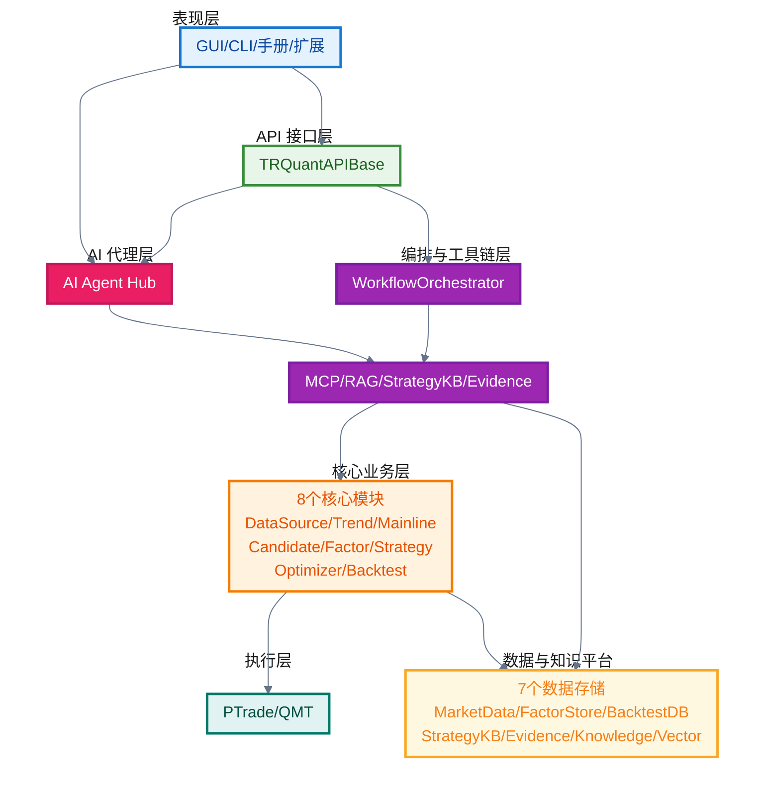
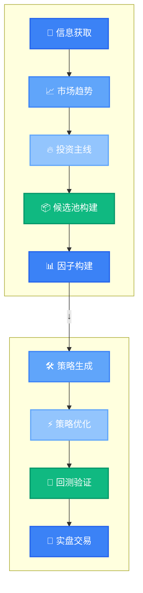

# 🏗️ 1.2 系统架构总览

> **核心摘要：**
> 
> 本节系统介绍TRQuant系统的分层架构设计、8步骤工作流编排和模块关系。通过理解表现层、API接口层、核心业务层、工作流编排层、工具链层和平台集成层的职责和关系，帮助开发者建立对系统整体架构的全面认知，为后续模块开发提供设计指导。

## 📋 章节概览

<script>
function scrollToSection(sectionId) {
  const element = document.getElementById(sectionId);
  if (element) {
    const headerOffset = 100;
    const elementPosition = element.getBoundingClientRect().top;
    const offsetPosition = elementPosition + window.pageYOffset - headerOffset;
    window.scrollTo({
      top: offsetPosition,
      behavior: 'smooth'
    });
  }
}
</script>

<div class="section-overview">
  <div class="section-item" onclick="scrollToSection('section-1-2-1')">
    <h4>🏗️ 1.2.1 总体架构</h4>
    <p>系统分层架构设计和架构图解析</p>
  </div>
  <div class="section-item" onclick="scrollToSection('section-1-2-2')">
    <h4>📊 1.2.2 分层设计</h4>
    <p>六层架构的职责、组件和特点详解</p>
  </div>
  <div class="section-item" onclick="scrollToSection('section-1-2-3')">
    <h4>🔄 1.2.3 8步骤工作流</h4>
    <p>工作流编排机制和步骤关系</p>
  </div>
  <div class="section-item" onclick="scrollToSection('section-1-2-4')">
    <h4>🔗 1.2.4 模块关系</h4>
    <p>业务模块间的关系和工具链集成</p>
  </div>
  <div class="section-item" onclick="scrollToSection('section-1-2-5')">
    <h4>💻 1.2.5 技术架构</h4>
    <p>后端、前端、工具链的技术选型</p>
  </div>
  <div class="section-item" onclick="scrollToSection('section-1-2-6')">
    <h4>🎯 1.2.6 设计原则</h4>
    <p>模块化、接口抽象、工作流编排、可追溯性</p>
  </div>
</div>

<h2 id="section-1-2-1">🏗️ 1.2.1 总体架构</h2>

### 架构设计理念

TRQuant系统采用**分层架构**和**模块化设计**，支持多种使用方式（桌面系统、Cursor扩展、命令行）。

### 系统架构图

> 💡 **提示**：下方是架构图缩略版，点击下方链接可查看完整详细版本或在 Mermaid Live Editor 中编辑。



<div style="text-align: center; margin: 1.5rem 0; padding: 1rem; background: #f8f9fa; border-radius: 8px;">
  <p style="margin: 0 0 1rem 0; color: #64748b; font-size: 0.9rem;">📊 查看完整详细架构图：</p>
  <div style="display: flex; gap: 0.75rem; justify-content: center; flex-wrap: wrap;">
    <a href="/architecture-diagram.mmd" download="system-architecture.mmd" style="display: inline-block; padding: 0.6rem 1.2rem; background: #3b82f6; color: white; border-radius: 6px; text-decoration: none; font-weight: 500; transition: all 0.2s;">
      📥 下载完整图
    </a>
    <a href="/architecture-diagram-thumbnail.mmd" download="system-architecture-thumbnail.mmd" style="display: inline-block; padding: 0.6rem 1.2rem; background: #3b82f6; color: white; border-radius: 6px; text-decoration: none; font-weight: 500; transition: all 0.2s;">
      📥 下载缩略图
    </a>
    <a href="https://mermaid.live/edit?gist=https://gist.github.com/TRQuant/ed73fdc2c254e7ee9c77ab337653a272" target="_blank" style="display: inline-block; padding: 0.6rem 1.2rem; background: #10b981; color: white; border-radius: 6px; text-decoration: none; font-weight: 500; transition: all 0.2s;">
      🎨 在线编辑缩略图（自动加载）⭐
    </a>
    <a href="https://mermaid.live/edit?gist=https://gist.github.com/TRQuant/7e3d4d7678f301f74be23d2efd7cc48d" target="_blank" style="display: inline-block; padding: 0.6rem 1.2rem; background: #10b981; color: white; border-radius: 6px; text-decoration: none; font-weight: 500; transition: all 0.2s;">
      🎨 在线编辑完整图（自动加载）⭐
    </a>
    <a href="https://gist.github.com/TRQuant/7e3d4d7678f301f74be23d2efd7cc48d" target="_blank" style="display: inline-block; padding: 0.6rem 1.2rem; background: #64748b; color: white; border-radius: 6px; text-decoration: none; font-weight: 500; transition: all 0.2s;">
      📋 查看完整图 Gist
    </a>
  </div>
  <p style="margin: 1rem 0 0 0; color: #10b981; font-size: 0.85rem;">✅ 点击 "在线编辑" 链接可直接在 Mermaid Live Editor 中打开并<strong>自动加载代码</strong>，无需手动操作！</p>
  <p style="margin: 0.5rem 0 0 0; color: #94a3b8; font-size: 0.85rem;">💡 关键：Gist 文件必须命名为 <code>code.mmd</code> 才能自动加载。代码已保存在 GitHub Gist，可随时访问和编辑。</p>
</div>

<details>
<summary style="cursor: pointer; padding: 0.75rem; background: #f1f5f9; border-radius: 6px; margin: 1rem 0; font-weight: 500; color: #334155;">📋 展开查看完整架构图代码</summary>



</details>

<h2 id="section-1-2-2">📊 1.2.2 分层设计</h2>

```mermaid
%%{init: {'theme':'base','themeVariables':{'primaryTextColor':'#1a1a1a','primaryBorderColor':'#666','primaryColor':'#7aa6d8','lineColor':'#64748b','secondaryColor':'transparent','tertiaryColor':'transparent','background':'transparent','mainBkg':'transparent','secondBkg':'transparent','tertiaryBkg':'transparent','subtitleColor':'#1a1a1a','titleColor':'#1a1a1a'},'flowchart':{'useMaxWidth':true,'htmlLabels':true,'curve':'basis','padding':10,'nodeSpacing':50,'rankSpacing':60}}}%%
flowchart TB

%% ================== 节点样式（高对比度优化，粉色/紫色使用白色文字） ==================
classDef layerUi        fill:#e3f2fd,stroke:#1976d2,stroke-width:2.5px,color:#0d47a1;
classDef layerApi       fill:#e8f5e9,stroke:#388e3c,stroke-width:2.5px,color:#1b5e20;
classDef layerAI        fill:#e91e63,stroke:#c2185b,stroke-width:2.5px,color:#ffffff;
classDef layerOrch      fill:#9c27b0,stroke:#7b1fa2,stroke-width:2.5px,color:#ffffff;
classDef layerTool      fill:#673ab7,stroke:#512da8,stroke-width:2.5px,color:#ffffff;
classDef layerCore      fill:#fff3e0,stroke:#f57c00,stroke-width:2.5px,color:#e65100;
classDef layerData      fill:#fff8e1,stroke:#f9a825,stroke-width:2.5px,color:#f57f17;
classDef layerExec      fill:#e0f2f1,stroke:#00796b,stroke-width:2.5px,color:#004d40;
classDef labelNode      fill:#f5f5f5,stroke:#616161,stroke-width:1.5px,color:#212121,font-size:11px;

%% ================== 箭头样式（高对比度优化） ==================
classDef edgeAI   stroke:#c2185b,stroke-width:3px;
classDef edgeOrch stroke:#7b1fa2,stroke-width:3px;
classDef edgeTool stroke:#512da8,stroke-width:3px;
classDef edgeData stroke:#f57c00,stroke-width:3px;
classDef edgeExec stroke:#00796b,stroke-width:3px;

%% ================== 表现层 ==================
subgraph Presentation["表现层"]
  direction LR
  GUI["桌面系统 GUI<br/>(PyQt6)"]:::layerUi
  CLI["命令行工具<br/>(CLI)"]:::layerUi
  AstroDoc["投研手册<br/>(Astro)"]:::layerUi
  CursorExt["Cursor 扩展<br/>(TypeScript)"]:::layerUi
end

%% ================== API 层 ==================
subgraph API["API 接口层"]
  APIBase["统一接口抽象<br/>TRQuantAPIBase"]:::layerApi
end

%% ================== AI 代理层 ==================
subgraph AILayer["AI 代理层（大模型参与）"]
  LLMHub["AI Agent Hub<br/>LLM 服务 + 工具调度"]:::layerAI
end

%% ================== 编排 & 工具链 ==================
subgraph Orchestration["编排与工具链层"]
  Orchestrator["WorkflowOrchestrator<br/>(工作流编排器)"]:::layerOrch

  subgraph Toolchain["工具链"]
    direction TB
    subgraph MCPServers["MCP Servers"]
      direction LR
      TRQuantMCP["TRQuant MCP<br/>trquant_market_status<br/>trquant_mainlines<br/>trquant_recommend_factors<br/>trquant_generate_strategy<br/>trquant_analyze_backtest"]:::layerTool
      KBMCPServer["KB MCP Server<br/>kb.query<br/>kb.stats<br/>kb.index.build"]:::layerTool
      DataCollector["Data Collector MCP<br/>data_collector.crawl_web<br/>data_collector.download_pdf<br/>data_collector.collect_academic<br/>data_collector.research"]:::layerTool
      OptimizerMCP["Optimizer MCP<br/>optimizer.analyze_backtest"]:::layerTool
      ManualGenMCP["Manual Generator MCP<br/>manual.create_chapter"]:::layerTool
    end
    StrategyKB["Strategy KB<br/>(策略知识)"]:::layerTool
    Evidence["Evidence<br/>(验证记录)"]:::layerTool
    RAGKB["RAG KB<br/>(知识检索)"]:::layerTool
  end
end

%% ================== 核心业务 ==================
subgraph Core["核心业务（通过 MCP 工具实现）"]
  direction TB
  subgraph CoreRow1[" "]
    direction LR
    DS["DataSource<br/>数据源管理"]:::layerCore
    TA["TrendAnalyzer<br/>市场分析"]:::layerCore
    ML["Mainline<br/>主线识别"]:::layerCore
    CP["CandidatePool<br/>候选池构建"]:::layerCore
  end
  subgraph CoreRow2[" "]
    direction LR
    FL["FactorLib<br/>因子库"]:::layerCore
    SD["StrategyDev<br/>策略开发"]:::layerCore
    OP["Optimizer<br/>策略优化"]:::layerCore
    BT["Backtest<br/>回测验证"]:::layerCore
  end
end

%% ================== 数据平台 ==================
subgraph DataPlatform["数据与知识平台"]
  direction TB
  subgraph DataRow1[" "]
    direction LR
    MarketDB["MarketDataDB<br/>行情 & 基本面库"]:::layerData
    FactorStore["FactorStore<br/>因子存储库"]:::layerData
    BacktestDB["BacktestDB<br/>回测结果库"]:::layerData
  end
  subgraph DataRow2[" "]
    direction LR
    StrategyStore["StrategyKBStore<br/>策略知识库存储"]:::layerData
    EvidenceStore["EvidenceStore<br/>验证记录库存储"]:::layerData
    KnowledgeIdx["KnowledgeIndex<br/>知识索引"]:::layerData
    VectorDB["VectorDB<br/>向量库"]:::layerData
  end
end

%% ================== 执行层 ==================
subgraph Execution["执行层"]
  PTrade["PTrade<br/>(交易平台)"]:::layerExec
  QMT["QMT<br/>(交易平台)"]:::layerExec
end

%% ================== 说明标签 ==================
LegendCall["工具调用"]:::labelNode
LegendAI["AI 决策 / 生成 / 解释"]:::labelNode
LegendData["数据读写"]:::labelNode

LegendCall -.- TRQuantMCP
LegendCall -.- KBMCPServer
LegendCall -.- DataCollector
LegendAI -.- LLMHub
LegendData -.- DataPlatform

%% ================== 主调用链 ==================

%% 表现层 → AI / API
CursorExt --> LLMHub:::edgeAI
GUI --> APIBase
CLI --> APIBase
AstroDoc --> APIBase

%% API → AI / 编排 / 工具
APIBase --> LLMHub:::edgeAI
APIBase --> Orchestrator:::edgeOrch
APIBase --> TRQuantMCP:::edgeTool
APIBase --> KBMCPServer:::edgeTool
APIBase --> DataCollector:::edgeTool

%% AI → 工具链 / 编排器
LLMHub --> TRQuantMCP:::edgeAI
LLMHub --> KBMCPServer:::edgeAI
LLMHub --> DataCollector:::edgeAI
LLMHub --> OptimizerMCP:::edgeAI
LLMHub --> Orchestrator:::edgeAI
LLMHub --> RAGKB:::edgeAI
LLMHub --> StrategyKB:::edgeAI
LLMHub --> Evidence:::edgeAI

%% 编排器 → MCP工具链
Orchestrator --> TRQuantMCP:::edgeOrch
Orchestrator --> KBMCPServer:::edgeOrch
Orchestrator --> DataCollector:::edgeOrch
Orchestrator --> RAGKB:::edgeOrch
Orchestrator --> StrategyKB:::edgeOrch
Orchestrator --> Evidence:::edgeOrch

%% MCP工具 → 核心业务（通过MCP工具调用实现）
TRQuantMCP --> TA:::edgeTool
TRQuantMCP --> ML:::edgeTool
TRQuantMCP --> FL:::edgeTool
TRQuantMCP --> SD:::edgeTool
TRQuantMCP --> BT:::edgeTool
DataCollector --> DS:::edgeTool
KBMCPServer --> DS:::edgeTool
KBMCPServer --> TA:::edgeTool
KBMCPServer --> ML:::edgeTool
KBMCPServer --> SD:::edgeTool

%% 核心业务 → 数据平台
DS --> MarketDB:::edgeData
FL --> FactorStore:::edgeData
BT --> BacktestDB:::edgeData

SD --> StrategyStore:::edgeData
OP --> StrategyStore:::edgeData
BT --> EvidenceStore:::edgeData

%% 工具链 → 数据平台
StrategyKB --> StrategyStore:::edgeData
Evidence --> EvidenceStore:::edgeData
RAGKB --> KnowledgeIdx:::edgeData
RAGKB --> VectorDB:::edgeData

%% 回测 → 执行层
BT --> PTrade:::edgeExec
BT --> QMT:::edgeExec
```

### 1. 表现层（Presentation Layer）

**职责**：用户交互、数据可视化

**组件**：
- **桌面系统GUI**（PyQt6）：完整的工作流界面
- **Cursor扩展**（TypeScript + React）：IDE集成的量化工作台
- **命令行工具**：脚本化使用方式

**特点**：
- 统一的API接口调用
- 实时进度显示
- 数据可视化

### 2. API接口层（API Layer）

**职责**：统一接口抽象，屏蔽底层实现

**组件**：
- `TRQuantAPIBase`：抽象基类
- `CoreAdapter`：核心模块适配器
- 统一的数据结构和错误处理

**特点**：
- 接口统一，易于扩展
- 支持多种实现方式
- 类型安全

### 3. 核心业务层（Core Business Layer）

**职责**：核心业务逻辑实现

**模块**：
- **数据源管理**（DataSource）：统一数据接口，多数据源支持
- **市场分析**（TrendAnalyzer）：趋势分析、市场状态判断
- **主线识别**（Mainline）：投资主线评分和筛选
- **候选池构建**（CandidatePool）：股票池管理、筛选规则
- **因子库**（FactorLib）：因子计算、因子管理、因子优化
- **策略开发**（StrategyDev）：策略模板、策略生成
- **策略优化**（Optimizer）：策略参数优化、策略调优
- **回测验证**（Backtest）：回测框架、策略验证与对比

**特点**：
- 模块化设计，职责清晰
- 可独立测试和部署
- 支持工作流编排

### 4. 工作流编排层（Workflow Orchestration Layer）

**职责**：编排8步骤投资工作流

**组件**：
- `WorkflowOrchestrator`：工作流编排器
- 步骤结果管理
- 工作流状态追踪

**特点**：
- 统一的工作流接口
- 支持步骤级调用
- 支持完整工作流执行

### 5. 工具链层（Toolchain Layer）

**职责**：提供开发工具链支持

**组件**：
- **黑客助理（Data Collector）**：深入研究工具，网页爬取、源码分析、自动化测试
- **其他 MCP Server**：工程编排、文档管理、代码分析等
- **RAG KB**：Manual KB、Engineering KB，知识检索
- **Strategy KB**：策略知识库，策略生成支持
- **Evidence Server**：证据记录，可追溯性

**特点**：
- 支持AI辅助开发
- 知识积累和复用
- 可追溯可审计

### 6. 数据与知识平台层（Data & Knowledge Platform Layer）

**职责**：数据存储、知识管理、向量检索

**架构设计**：采用**分层/多存储（Polyglot Persistence）**架构，根据数据类型选择最适合的存储方案。

**数据存储架构**：

#### 6.1 主数据库：PostgreSQL

**用途**：强事务/强审计类数据（OLTP）

**存储内容**：
- **策略仓库**：策略元数据、版本、作者、上线记录、参数集、回测任务定义
- **审批流**：策略评审、风控审批、上线/停机审批、变更记录
- **实盘账务**：账户、订单、成交、持仓、资金流水、对账差异
- **审计日志**：谁在什么时候做了什么（不可篡改、可追溯）
- **权限管理**：用户、角色、权限配置

**技术特点**：
- ACID事务保证
- 强约束（外键、唯一键、检查约束）
- JSONB支持半结构化数据（策略配置、因子配置）
- GIN索引支持文档内检索
- 审计表 append-only（按日分区）

#### 6.2 时序分析库：ClickHouse 或 TimescaleDB

**用途**：时间序列/分析类数据（OLAP/TSDB）

**存储内容**：
- **行情数据**：OHLCV（日/分钟/Tick）、盘口快照
- **因子数据**：每日/每分钟因子矩阵
- **回测输出**：净值曲线、分层归因、行业暴露、换手、滑点统计
- **实盘监控**：PnL曲线、回撤、风控事件时间线

**技术选型**：
- **ClickHouse**：适合高频聚合分析、大规模分钟/逐笔数据、极致性能
- **TimescaleDB**：适合一体化方案、中等规模时序数据、SQL生态

**注意**：也可使用 Parquet/HDF5 文件缓存作为补充方案。

#### 6.3 对象存储：MinIO/S3

**用途**：文档/半结构化文件存储

**存储内容**：
- **回测报告**：HTML/PDF格式
- **图表产物**：策略图表、分析图表
- **研究文档**：研究笔记、策略说明、Prompt版本快照

**技术特点**：
- 数据库只存元数据（hash、路径、生成时间、关联策略id）
- 支持版本管理
- 支持访问控制

#### 6.4 缓存/队列：Redis

**用途**：缓存和任务队列

**存储内容**：
- **行情快照缓存**：实时行情数据缓存
- **任务队列**：回测任务、数据更新任务
- **风控状态机**：短期状态存储

**技术特点**：
- 高性能内存存储
- 支持发布/订阅
- 支持过期策略

#### 6.5 知识库存储

**向量数据库（Chroma）**：
- **Manual KB**：开发手册知识库（35,527 chunks）
- **Engineering KB**：工程知识库（14,945 symbols）
- **向量检索**：语义相似度检索

**策略知识库（Strategy KB）**：
- **结构化存储**：JSON格式存储策略知识
- **规则引擎**：策略规则验证

**知识索引（Knowledge Index）**：
- **BM25索引**：关键词检索
- **混合检索**：向量检索 + BM25检索 + 重排序

### 7. 平台集成层（Platform Integration Layer）

**职责**：与交易平台集成

**组件**：
- **PTrade集成**：PTrade API封装
- **QMT集成**：QMT API封装
- **实盘反馈**：实盘数据回流，策略优化

**特点**：
- 统一的交易接口
- 实盘数据反馈
- 风险监控

<h2 id="section-1-2-3">🔄 1.2.3 8步骤工作流</h2>

### 工作流定义

> 💡 **提示**：此工作流图使用 `manual.generate_workflow_diagram` MCP工具生成，智能布局功能确保步骤较多时自动分成**上下两行**显示，避免超出页面范围。关键实现：使用`flowchart TB`作为主方向，使用`rank=same`强制节点在同一行，从第一行最后一个到第二行第一个使用向下箭头（↓）。



### 工作流编排机制

**步骤级调用**：
- 每个步骤可独立调用
- 步骤间通过结果传递数据
- 支持步骤级测试和调试

**完整工作流执行**：
- 支持一键执行完整工作流
- 自动处理步骤依赖
- 实时进度显示

### 工作流状态管理

- **步骤状态**：pending、running、completed、failed
- **结果管理**：步骤结果持久化
- **错误处理**：步骤失败时的回滚和重试

<h2 id="section-1-2-4">🔗 1.2.4 模块关系</h2>

### 8步骤工作流模块关系

```
数据源管理 (步骤1)
    ↓
市场分析 (步骤2) ──┐
    ↓              │
主线识别 (步骤3) ──┤
    ↓              │
候选池构建 (步骤4) ─┤
    ↓              │
因子构建 (步骤5) ──┤
    ↓              │
策略生成 (步骤6) ──┤
    ↓              │
策略优化 (步骤6.5) ─┤ 接收前序步骤信息
    ↓              │
回测验证 (步骤7) ───┘ 反馈回测结果
    ↓
实盘交易 (步骤8)
```

### 工具链与业务模块关系

```
工具链层
    │
    ├──→ 黑客助理（Data Collector） ──→ 深入研究、源码分析、自动化测试
    ├──→ 其他 MCP Server ──→ 工程编排、文档管理
    │
    ├──→ RAG KB ──→ 知识检索、内容生成
    │
    ├──→ Strategy KB ──→ 策略生成支持
    │
    └──→ Evidence ──→ 证据记录、可追溯性
            │
            └──→ 所有业务模块
```

<h2 id="section-1-2-5">💻 1.2.5 技术架构</h2>

### 后端架构

- **语言**：Python 3.11+
- **核心框架**：模块化设计，依赖注入
- **数据存储**：分层/多存储架构
  - **PostgreSQL**：主数据库（策略、审批、审计、权限）
  - **ClickHouse/TimescaleDB**：时序分析库（行情、因子、回测曲线）
  - **MinIO/S3**：对象存储（报告、图表、文档）
  - **Redis**：缓存/队列（行情缓存、任务队列）
  - **Chroma**：向量数据库（知识库）
- **异步处理**：asyncio支持

### 前端架构

- **桌面系统**：PyQt6，原生GUI
- **Cursor扩展**：TypeScript + React，WebView
- **文档站点**：Astro + React，静态生成

### 工具链架构

- **MCP协议**：Model Context Protocol，AI工具集成
  - **黑客助理（Data Collector Server）**：专门用于深入研究、源码分析、自动化测试的工具
  - **其他 MCP Server**：工程编排、文档管理、代码分析等通用工具
- **RAG技术**：向量检索，知识库查询
- **Strategy KB**：结构化知识库，策略规则

<h2 id="section-1-2-6">🎯 1.2.6 设计原则</h2>

### 1. 模块化设计

- 每个模块职责单一
- 模块间低耦合高内聚
- 支持独立测试和部署

**设计原理**：
- **单一职责原则**：每个模块只负责一个功能领域，避免职责混乱
- **低耦合高内聚**：模块间通过接口通信，减少直接依赖，提高可维护性
- **独立测试**：模块可以独立测试，提高测试覆盖率和开发效率

**为什么这样设计**：
- 系统功能复杂，模块化可以降低复杂度
- 支持团队协作开发，不同开发者可以并行开发不同模块
- 便于功能扩展和维护，修改一个模块不影响其他模块

### 2. 接口抽象

- 统一的API接口
- 支持多种实现方式
- 易于扩展和维护

**设计原理**：
- **接口隔离**：定义清晰的接口，隐藏实现细节
- **多态支持**：同一接口可以有多种实现，运行时选择
- **依赖倒置**：高层模块依赖抽象接口，不依赖具体实现

**为什么这样设计**：
- 数据源有多种实现（JQData、AKShare、Baostock），需要统一接口
- 支持数据源切换，不影响上层业务逻辑
- 便于添加新的数据源实现，符合开闭原则

### 3. 工作流编排

- 统一的工作流接口
- 支持步骤级调用
- 支持完整工作流执行

**设计原理**：
- **编排模式**：将复杂流程分解为多个步骤，统一编排
- **步骤独立**：每个步骤可以独立执行和测试
- **流程可配置**：支持自定义工作流，灵活组合步骤

**为什么这样设计**：
- 8步骤工作流复杂，需要统一管理
- 用户可能需要单独执行某个步骤，不需要完整流程
- 支持工作流的扩展和定制，适应不同场景

### 4. 可追溯性

- 所有操作记录证据
- 版本管理
- 可审计可复现

**设计原理**：
- **证据链**：每个操作都记录输入、输出、时间戳等信息
- **版本控制**：策略、配置等都有版本管理
- **审计日志**：记录所有关键操作，支持审计

**为什么这样设计**：
- 量化投资需要可复现性，确保结果可信
- 监管要求可审计，需要完整的操作记录
- 问题排查需要追溯历史操作，定位问题根源

## 🔗 相关章节

- **1.1 项目背景与目标**：了解系统的核心定位
- **1.3 技术栈选型**：理解技术选型的详细理由
- **1.9 数据库架构设计**：深入了解分层/多存储架构设计
- **第二章 数据源**：了解数据源管理模块的实现
- **第十章 开发指南**：掌握系统开发的具体方法

## 💡 关键要点

1. **分层架构**：七层架构设计，职责清晰
   - 表现层、API接口层、AI代理层、编排与工具链层、核心业务层、数据与知识平台层、平台集成层
2. **工作流编排**：8步骤工作流，支持步骤级和完整执行
3. **模块化设计**：模块职责单一，低耦合高内聚
4. **数据存储架构**：分层/多存储（Polyglot Persistence）架构
   - PostgreSQL：强事务/强审计数据
   - ClickHouse/TimescaleDB：时序分析数据
   - MinIO/S3：对象存储
   - Redis：缓存/队列
   - Chroma：向量数据库
5. **工具链支持**：黑客助理（Data Collector）、其他 MCP Server、RAG、Strategy KB全面支持
   - 遵循"不确定时，先研究再实现"的开发方法论
   - 支持多角度验证（网页爬取、源码分析、实际测试）
   - 循环迭代直到找到正确方案

---

*最后更新: 2025-12-11*  
*适用版本: v1.0.0+*
