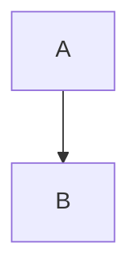

# 架构文档目录

本目录包含TRQuant系统的架构文档，采用Mermaid + PlantUML双组合方案。

## 目录结构

```
architecture/
├── plantuml/              # PlantUML源文件
│   ├── system-overview.puml
│   ├── component-diagram.puml
│   └── sequence-diagram.puml
└── README.md              # 本文件
```

## 使用说明

### Mermaid（文档展示）

在Markdown文档中直接使用Mermaid代码块：



### PlantUML（架构验证）

1. 编辑 `.puml` 文件
2. 运行生成脚本：`scripts/generate-architecture-diagrams.sh`
3. 生成的图片保存在 `docs/images/architecture/`

## 相关文档

- [架构文档规范指南](../extension/AShare-manual/docs/architecture_documentation_guide.md)

