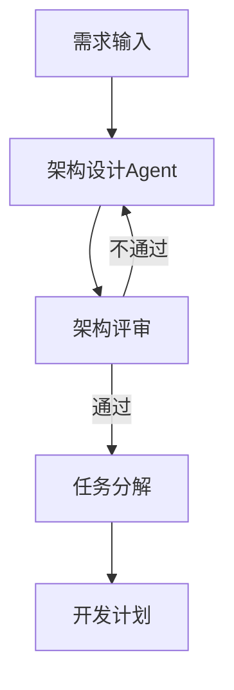
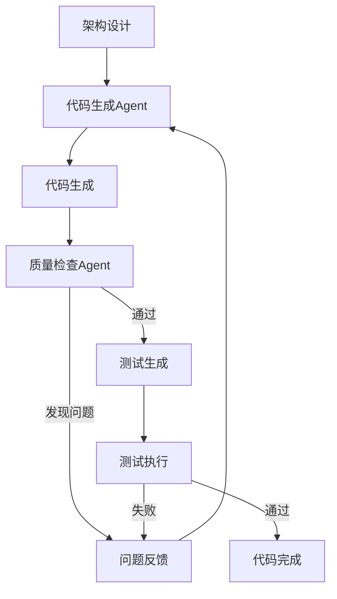
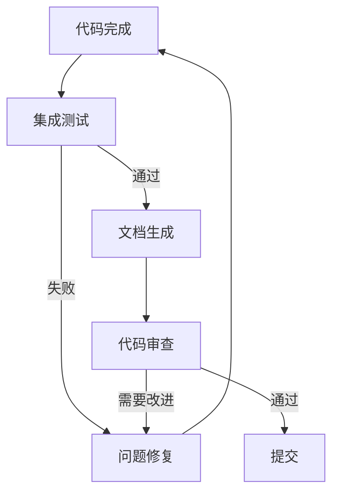

# AI Agents 整合方案 - 高质量代码生成保障体系

## 📋 概述

基于 [FoundationAgents](https://github.com/FoundationAgents) 组织的最佳实践，整合多代理框架、代码质量保证机制和自动化工作流，与现有 Cursor AI 规范一起，构建完整的代码生成质量保障体系。

---

## 🎯 核心目标

1. **多代理协作**：借鉴 MetaGPT 的多代理框架，实现角色分工和协作
2. **递归代码生成**：参考 ReCode 的递归生成机制，确保代码质量
3. **自动化工作流**：参考 AFlow 的自动化工作流生成
4. **自学习能力**：整合 LightAgent 的自学习特性
5. **质量保证**：结合现有规范，确保生成代码可运行、可维护

---

## 🏗️ 架构设计

### 三层 Agent 体系

```
┌─────────────────────────────────────────────────────────┐
│               Agent 协调层 (Agent Orchestrator)          │
│  - 任务分解与分配                                        │
│  - 多代理协作管理                                        │
│  - 质量检查与验证                                        │
└─────────────────────────────────────────────────────────┘
                        │
        ┌───────────────┼───────────────┐
        │               │               │
┌───────▼──────┐ ┌──────▼──────┐ ┌──────▼──────┐
│  架构设计    │ │  代码生成    │ │  质量检查    │
│  Agent      │ │  Agent      │ │  Agent      │
│             │ │             │ │             │
│ - 系统设计  │ │ - 功能实现  │ │ - 代码审查  │
│ - API设计   │ │ - 测试生成  │ │ - 规范检查  │
│ - 模块划分  │ │ - 文档生成  │ │ - 性能分析  │
└─────────────┘ └─────────────┘ └─────────────┘
```

### Agent 角色定义

#### 1. 架构设计 Agent (Architect Agent)
**职责**：
- 分析需求，设计系统架构
- 定义模块接口和数据结构
- 制定开发计划和任务分解

**参考**：MetaGPT 的 ProductManager + Architect 角色

**Prompt 模板**：
```python
ARCHITECT_PROMPT = """
你是TRQuant系统的架构设计师，负责BulletTrade模块的架构设计。

## 任务
分析以下需求，设计模块架构：

### 需求
{requirements}

### 约束条件
- 必须遵循现有代码规范（.cursorrules）
- 必须与现有模块兼容（core/trading/, core/broker/）
- 必须支持聚宽API兼容
- 必须支持多券商接口（QMT、PTrade、掘金）

### 输出要求
1. 模块结构设计（目录树）
2. 核心类和方法定义
3. 接口设计（输入输出类型）
4. 依赖关系图
5. 开发任务分解（按优先级）

请提供详细的架构设计文档。
"""
```

#### 2. 代码生成 Agent (Code Generator Agent)
**职责**：
- 根据架构设计生成代码
- 实现具体功能逻辑
- 生成单元测试
- 生成文档字符串

**参考**：ReCode 的递归代码生成机制

**Prompt 模板**：
```python
CODE_GENERATOR_PROMPT = """
你是TRQuant系统的代码生成专家，负责实现BulletTrade模块。

## 任务
根据架构设计生成高质量代码：

### 架构设计
{architecture}

### 实现要求
1. **代码规范**：
   - 严格遵循PEP 8
   - 所有函数必须有类型注解
   - 所有公共函数必须有docstring（Google风格）
   - 行长度不超过100字符

2. **质量要求**：
   - 单一职责原则
   - 函数长度不超过50行
   - 完整的错误处理
   - 避免使用any类型（TypeScript）

3. **测试要求**：
   - 为每个公共函数生成单元测试
   - 测试覆盖率目标>80%

### 生成步骤
1. 先生成接口定义（类型、接口）
2. 再生成实现代码
3. 最后生成测试代码

请按步骤生成，每步完成后进行自检。
"""
```

#### 3. 质量检查 Agent (Quality Checker Agent)
**职责**：
- 代码规范检查
- 类型安全检查
- 逻辑错误检测
- 性能分析
- 安全漏洞扫描

**参考**：LightAgent 的自学习能力 + 静态分析工具

**检查清单**：
```python
QUALITY_CHECKLIST = {
    "代码规范": [
        "✓ PEP 8 合规性",
        "✓ 类型注解完整性",
        "✓ 文档字符串完整性",
        "✓ 命名规范一致性"
    ],
    "类型安全": [
        "✓ 无any类型（TypeScript）",
        "✓ 类型推断正确性",
        "✓ 接口实现完整性"
    ],
    "逻辑正确性": [
        "✓ 边界条件处理",
        "✓ 异常处理完整性",
        "✓ 资源释放（文件、连接）"
    ],
    "性能": [
        "✓ 无明显的性能瓶颈",
        "✓ 算法复杂度合理",
        "✓ 内存使用优化"
    ],
    "安全性": [
        "✓ 输入验证",
        "✓ SQL注入防护",
        "✓ 路径遍历防护"
    ]
}
```

---

## 🔄 工作流程

### 阶段一：需求分析与架构设计



**实现步骤**：
1. 用户输入需求（自然语言或结构化描述）
2. 架构设计Agent分析需求，生成架构设计
3. 质量检查Agent审查架构设计
4. 如果通过，生成开发计划；否则返回步骤2

### 阶段二：代码生成与迭代优化



**实现步骤**：
1. 代码生成Agent根据架构设计生成代码
2. 质量检查Agent进行静态分析
3. 如果发现问题，反馈给代码生成Agent迭代
4. 生成单元测试并执行
5. 测试通过后，代码完成

### 阶段三：集成测试与文档生成



---

## 🛠️ 技术实现

### 1. Agent 协调器

```python
# core/agents/orchestrator.py
from typing import List, Dict, Any
from dataclasses import dataclass
from enum import Enum

class AgentRole(Enum):
    """Agent角色"""
    ARCHITECT = "architect"
    CODE_GENERATOR = "code_generator"
    QUALITY_CHECKER = "quality_checker"
    TEST_GENERATOR = "test_generator"
    DOCUMENTER = "documenter"

@dataclass
class Task:
    """任务定义"""
    id: str
    description: str
    role: AgentRole
    dependencies: List[str]
    status: str = "pending"

class AgentOrchestrator:
    """Agent协调器
    
    负责任务分解、分配和协调多个Agent协作
    """
    
    def __init__(self):
        self.agents = {}
        self.tasks: List[Task] = []
        self.results: Dict[str, Any] = {}
    
    def register_agent(self, role: AgentRole, agent):
        """注册Agent"""
        self.agents[role] = agent
    
    def decompose_task(self, requirement: str) -> List[Task]:
        """分解任务
        
        参考MetaGPT的任务分解机制
        """
        # 1. 架构设计任务
        arch_task = Task(
            id="arch_001",
            description="设计BulletTrade模块架构",
            role=AgentRole.ARCHITECT,
            dependencies=[]
        )
        
        # 2. 代码生成任务（依赖架构设计）
        code_tasks = [
            Task(
                id=f"code_{i:03d}",
                description=f"实现模块{i}",
                role=AgentRole.CODE_GENERATOR,
                dependencies=["arch_001"]
            )
            for i in range(1, 6)  # 假设5个模块
        ]
        
        # 3. 质量检查任务（依赖代码生成）
        quality_tasks = [
            Task(
                id=f"quality_{i:03d}",
                description=f"检查模块{i}代码质量",
                role=AgentRole.QUALITY_CHECKER,
                dependencies=[f"code_{i:03d}"]
            )
            for i in range(1, 6)
        ]
        
        return [arch_task] + code_tasks + quality_tasks
    
    def execute_task(self, task: Task) -> Any:
        """执行任务"""
        agent = self.agents.get(task.role)
        if not agent:
            raise ValueError(f"Agent {task.role} not registered")
        
        # 检查依赖
        for dep_id in task.dependencies:
            if dep_id not in self.results:
                raise ValueError(f"Dependency {dep_id} not completed")
        
        # 执行任务
        result = agent.execute(task, self.results)
        self.results[task.id] = result
        task.status = "completed"
        
        return result
    
    def run(self, requirement: str) -> Dict[str, Any]:
        """运行完整工作流"""
        # 1. 任务分解
        tasks = self.decompose_task(requirement)
        self.tasks = tasks
        
        # 2. 按依赖顺序执行
        completed = set()
        while len(completed) < len(tasks):
            for task in tasks:
                if task.id in completed:
                    continue
                
                # 检查依赖是否完成
                deps_ready = all(
                    dep_id in completed
                    for dep_id in task.dependencies
                )
                
                if deps_ready:
                    try:
                        self.execute_task(task)
                        completed.add(task.id)
                    except Exception as e:
                        logger.error(f"Task {task.id} failed: {e}")
                        raise
        
        return self.results
```

### 2. 代码生成 Agent（递归生成）

```python
# core/agents/code_generator.py
class CodeGeneratorAgent:
    """代码生成Agent
    
    参考ReCode的递归代码生成机制
    """
    
    def __init__(self, llm_client):
        self.llm_client = llm_client
        self.max_iterations = 3
    
    def generate_code(
        self,
        architecture: Dict,
        module_name: str,
        iteration: int = 0
    ) -> Dict[str, Any]:
        """递归生成代码
        
        Args:
            architecture: 架构设计
            module_name: 模块名称
            iteration: 当前迭代次数
            
        Returns:
            生成的代码和元数据
        """
        if iteration >= self.max_iterations:
            raise ValueError("Max iterations reached")
        
        # 1. 生成代码
        prompt = self._build_prompt(architecture, module_name)
        code = self.llm_client.generate(prompt)
        
        # 2. 自检
        issues = self._self_check(code, architecture)
        
        # 3. 如果有问题，递归修复
        if issues:
            logger.info(f"Iteration {iteration + 1}: Found {len(issues)} issues")
            fixed_code = self._fix_issues(code, issues)
            return self.generate_code(
                architecture,
                module_name,
                iteration + 1
            )
        
        # 4. 生成测试
        tests = self._generate_tests(code, module_name)
        
        return {
            "code": code,
            "tests": tests,
            "iteration": iteration + 1,
            "quality_score": self._calculate_quality_score(code)
        }
    
    def _self_check(self, code: str, architecture: Dict) -> List[str]:
        """自检代码质量"""
        issues = []
        
        # 检查类型注解
        if not self._has_type_hints(code):
            issues.append("缺少类型注解")
        
        # 检查文档字符串
        if not self._has_docstrings(code):
            issues.append("缺少文档字符串")
        
        # 检查规范
        if not self._check_style(code):
            issues.append("代码风格不符合规范")
        
        return issues
    
    def _fix_issues(self, code: str, issues: List[str]) -> str:
        """修复问题"""
        fix_prompt = f"""
        以下代码存在问题：
        {chr(10).join(issues)}
        
        请修复以下代码：
        ```python
        {code}
        ```
        
        修复要求：
        1. 保持原有功能不变
        2. 修复所有问题
        3. 遵循代码规范
        """
        return self.llm_client.generate(fix_prompt)
```

### 3. 质量检查 Agent

```python
# core/agents/quality_checker.py
import ast
import subprocess
from typing import List, Dict

class QualityCheckerAgent:
    """质量检查Agent"""
    
    def __init__(self):
        self.checkers = [
            self._check_syntax,
            self._check_style,
            self._check_types,
            self._check_security,
            self._check_performance
        ]
    
    def check(self, code: str, file_path: str) -> Dict[str, Any]:
        """全面质量检查"""
        results = {
            "syntax": True,
            "style": True,
            "types": True,
            "security": True,
            "performance": True,
            "issues": []
        }
        
        for checker in self.checkers:
            try:
                check_result = checker(code, file_path)
                if not check_result["passed"]:
                    results[checker.__name__.replace("_check_", "")] = False
                    results["issues"].extend(check_result["issues"])
            except Exception as e:
                logger.error(f"Checker {checker.__name__} failed: {e}")
        
        results["score"] = self._calculate_score(results)
        return results
    
    def _check_syntax(self, code: str, file_path: str) -> Dict:
        """语法检查"""
        try:
            ast.parse(code)
            return {"passed": True, "issues": []}
        except SyntaxError as e:
            return {
                "passed": False,
                "issues": [f"语法错误: {e.msg} at line {e.lineno}"]
            }
    
    def _check_style(self, code: str, file_path: str) -> Dict:
        """代码风格检查（使用ruff）"""
        try:
            result = subprocess.run(
                ["ruff", "check", "--stdin-filename", file_path],
                input=code.encode(),
                capture_output=True,
                timeout=10
            )
            
            if result.returncode != 0:
                issues = result.stdout.decode().split("\n")
                return {"passed": False, "issues": issues}
            
            return {"passed": True, "issues": []}
        except Exception as e:
            logger.warning(f"Style check failed: {e}")
            return {"passed": True, "issues": []}  # 不阻塞
    
    def _check_types(self, code: str, file_path: str) -> Dict:
        """类型检查（使用mypy）"""
        # 实现类型检查逻辑
        pass
    
    def _check_security(self, code: str, file_path: str) -> Dict:
        """安全检查"""
        issues = []
        
        # 检查危险函数
        dangerous_patterns = [
            ("eval(", "使用eval()存在安全风险"),
            ("exec(", "使用exec()存在安全风险"),
            ("__import__", "动态导入存在安全风险"),
            ("pickle.loads", "反序列化存在安全风险")
        ]
        
        for pattern, message in dangerous_patterns:
            if pattern in code:
                issues.append(message)
        
        return {
            "passed": len(issues) == 0,
            "issues": issues
        }
    
    def _check_performance(self, code: str, file_path: str) -> Dict:
        """性能检查"""
        issues = []
        
        # 检查明显的性能问题
        if "for " in code and "for " in code[code.find("for ")+4:]:
            issues.append("检测到嵌套循环，可能影响性能")
        
        return {
            "passed": len(issues) == 0,
            "issues": issues
        }
    
    def _calculate_score(self, results: Dict) -> float:
        """计算质量分数（0-100）"""
        weights = {
            "syntax": 0.3,
            "style": 0.2,
            "types": 0.2,
            "security": 0.2,
            "performance": 0.1
        }
        
        score = 0
        for key, weight in weights.items():
            if results.get(key, False):
                score += weight * 100
        
        return score
```

---

## 📋 集成到现有流程

### 1. 与 Cursor AI 集成

在 `.cursorrules` 中添加 Agent 工作流：

```markdown
## AI Agent 工作流

### 开发新功能时

1. **架构设计阶段**
   - 使用 Architect Agent 分析需求
   - 生成架构设计文档
   - 任务分解

2. **代码生成阶段**
   - 使用 Code Generator Agent 生成代码
   - 递归优化直到质量达标

3. **质量检查阶段**
   - 使用 Quality Checker Agent 全面检查
   - 修复所有问题

4. **测试生成阶段**
   - 自动生成单元测试
   - 执行测试并修复

### Prompt 模板

在生成代码时，使用以下模板：

```
你是TRQuant系统的{Agent角色}，负责{具体任务}。

## 上下文
{相关代码和文档}

## 任务
{具体任务描述}

## 约束
- 遵循.cursorrules规范
- 遵循.cursor-rules-trquant.md规则
- 参考现有代码模式

## 输出要求
{具体要求}
```
```

### 2. 与 BulletTrade 开发计划整合

在 `docs/BULLETTRADE_DEVELOPMENT_PLAN.md` 中，每个任务都使用 Agent 工作流：

```markdown
### 任务1.1.1：安装和配置BulletTrade依赖

**Agent工作流**：
1. Architect Agent：设计依赖管理方案
2. Code Generator Agent：生成requirements.txt更新
3. Quality Checker Agent：检查依赖冲突

**实现步骤**：
- [使用Agent生成] 更新requirements.txt
- [使用Agent生成] 创建配置管理模块
- [使用Agent生成] 实现环境检测
```

---

## 🎯 质量保证机制

### 1. 多层质量检查

```
代码生成
  ↓
语法检查 (AST解析)
  ↓
风格检查 (ruff)
  ↓
类型检查 (mypy)
  ↓
安全扫描 (bandit)
  ↓
性能分析 (cProfile)
  ↓
测试执行 (pytest)
  ↓
集成测试
  ↓
代码审查 (人工)
```

### 2. 自动修复机制

参考 ReCode 的递归生成，实现自动修复：

```python
def auto_fix(code: str, issues: List[str]) -> str:
    """自动修复代码问题"""
    fix_prompt = f"""
    修复以下代码问题：
    {chr(10).join(issues)}
    
    代码：
    ```python
    {code}
    ```
    
    要求：
    1. 修复所有问题
    2. 保持功能不变
    3. 遵循代码规范
    """
    return llm_client.generate(fix_prompt)
```

### 3. 质量评分系统

```python
@dataclass
class QualityScore:
    """质量评分"""
    syntax: float = 100.0      # 语法正确性
    style: float = 100.0       # 代码风格
    types: float = 100.0       # 类型安全
    security: float = 100.0     # 安全性
    performance: float = 100.0  # 性能
    test_coverage: float = 0.0 # 测试覆盖率
    
    @property
    def total(self) -> float:
        """总分（加权平均）"""
        weights = {
            "syntax": 0.2,
            "style": 0.15,
            "types": 0.15,
            "security": 0.2,
            "performance": 0.1,
            "test_coverage": 0.2
        }
        return sum(
            getattr(self, key) * weight
            for key, weight in weights.items()
        )
    
    def is_acceptable(self, threshold: float = 80.0) -> bool:
        """是否可接受"""
        return self.total >= threshold
```

---

## 📊 使用示例

### 示例：生成 BulletTrade 回测模块

```python
# 1. 初始化协调器
orchestrator = AgentOrchestrator()

# 2. 注册Agent
orchestrator.register_agent(
    AgentRole.ARCHITECT,
    ArchitectAgent(llm_client)
)
orchestrator.register_agent(
    AgentRole.CODE_GENERATOR,
    CodeGeneratorAgent(llm_client)
)
orchestrator.register_agent(
    AgentRole.QUALITY_CHECKER,
    QualityCheckerAgent()
)

# 3. 运行工作流
requirement = """
实现BulletTrade回测执行模块（bt_run.py）：
- 封装bullet-trade backtest命令
- 支持Python API接口
- 自动保存回测结果
- 支持进度回调
"""

results = orchestrator.run(requirement)

# 4. 检查结果
for task_id, result in results.items():
    if "quality_score" in result:
        score = result["quality_score"]
        if score < 80:
            print(f"警告：{task_id} 质量分数 {score} < 80")
        else:
            print(f"✓ {task_id} 质量分数 {score}")
```

---

## 🔗 参考资源

1. **FoundationAgents**: https://github.com/FoundationAgents
   - MetaGPT: 多代理框架
   - ReCode: 递归代码生成
   - AFlow: 自动化工作流

2. **相关项目**:
   - LightAgent: 轻量级代理框架
   - ModelScope-Agent: 通用代理框架

3. **现有规范**:
   - `.cursorrules`: Cursor AI 开发规则
   - `.cursor-rules-trquant.md`: TRQuant 特定规则
   - `docs/CODE_STANDARDS.md`: 代码标准

---

## 📝 实施计划

### 阶段一：基础框架（1周）
- [ ] 实现 AgentOrchestrator
- [ ] 实现基础 Agent（Architect, CodeGenerator, QualityChecker）
- [ ] 集成到 Cursor AI 工作流

### 阶段二：质量保证（1周）
- [ ] 实现多层质量检查
- [ ] 实现自动修复机制
- [ ] 实现质量评分系统

### 阶段三：集成测试（1周）
- [ ] 在 BulletTrade 开发中应用
- [ ] 收集反馈并优化
- [ ] 完善文档

---

**文档版本**: v1.0  
**创建日期**: 2025-12-07  
**最后更新**: 2025-12-07

