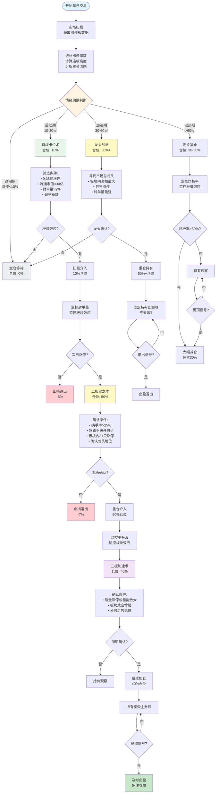

# 陈小群游资战法完整策略指南

> **更新时间**: 2026-01-13  
> **策略来源**: 知识库检索 + 实战案例验证  
> **可靠性评级**: B级（中高可靠性）

---

## 📊 策略核心思想

陈小群游资战法的核心是：**跟随市场合力，精准择时，严格纪律**。

### 三大战法体系

1. **三板斧战法**：三阶段仓位分配，从试错到重仓
2. **龙头战法**：聚焦总龙头，重仓持有享受主升浪
3. **合力情绪战法**：识别并跟随市场合力，不做"孤勇者"

---

## 🔄 完整交易流程图



---

## 📝 详细步骤说明

### 第一步：市场环境判断（情绪周期）

#### 判断标准

| 周期阶段 | 涨停家数 | 连板高度 | 炸板率 | 资金净流入 | 仓位策略 | 策略选择 |
|---------|---------|---------|--------|-----------|---------|---------|
| **退潮期** | <10只 | <3板 | >40% | 净流出 | **0%** | 空仓等待 |
| **启动期** | 10-30只 | 3-4板 | 10-20% | 小幅净流入 | **10%** | 首板卡位术 |
| **加速期** | 30-60只 | 4-6板 | 15-25% | 大幅净流入 | **50%+** | 龙头战法 |
| **过热期** | >60只 | >7板 | >30% | 极度净流入 | **30-50%** | 逐步减仓 |

#### 数据验证方法

**1. 获取涨停板数据**
```python
import akshare as ak

# 获取当日涨停板数据
limit_up_data = ak.stock_zt_pool_em(date='20260113')
limit_up_count = len(limit_up_data)
print(f"涨停家数: {limit_up_count}")

# 分析连板高度
for stock in limit_up_data.head(20):
    code = stock['代码']
    # 获取最近5天的价格数据
    price_data = jq.get_price(code, count=5, end_date=today, frequency='daily')
    # 计算连续涨停天数
    consecutive_limit_up = calculate_consecutive_limit_up(price_data)
```

**2. 获取资金流向数据**
```python
import jqdatasdk as jq

# 获取资金流向
money_flow = jq.get_money_flow(['000001.XSHG', '399001.XSHE'], 
                               start_date=prev_day, end_date=today)
net_inflow = money_flow['net_pct_main'].sum()
print(f"资金净流入: {net_inflow:.2f}%")
```

**3. 计算炸板率**
```python
# 获取当日涨停板数据
limit_up_data = ak.stock_zt_pool_em(date=today)

# 获取炸板股票（曾经涨停但收盘未封板）
for stock in limit_up_data:
    price_data = jq.get_price(stock['代码'], count=1, end_date=today, frequency='1m')
    # 判断是否炸板
    if price_data['close'].iloc[-1] < price_data['high_limit'].iloc[-1] * 0.995:
       炸板数量 += 1

炸板率 = 炸板数量 / 涨停数量 * 100
```

**是否有道理**：✅ **非常有道理**
- 情绪周期是A股市场的核心特征
- 不同周期适合不同策略，可以提高成功率
- 退潮期空仓可以避免大部分亏损
- 数据可验证，具有可操作性

---

### 第二步：首板卡位术（10%试错仓）

#### 选股条件（必选）

1. **时间条件**：早盘9:35前涨停
   - **验证方法**：获取分时数据，检查9:35前的价格
   - **是否有道理**：✅ 早盘涨停说明资金急迫，通常是强势信号

2. **市值条件**：流通市值<30亿
   - **验证方法**：`jq.get_security_info(code)['circulating_cap']`
   - **是否有道理**：✅ 小市值股票更容易被资金推动

3. **封单条件**：封单量>流通市值2%
   - **验证方法**：获取买一挂单量，计算占比
   - **是否有道理**：✅ 封单量大说明资金共识强，不容易开板

4. **题材条件**：题材新颖、有想象空间
   - **验证方法**：检索相关新闻，分析题材热度
   - **是否有道理**：✅ 新颖题材容易吸引资金关注

5. **板块条件**：板块内至少3只跟风股涨停
   - **验证方法**：获取板块内股票，统计涨停数量
   - **是否有道理**：✅ 板块效应可以降低个股风险

#### 操作方式

- **介入方式**：扫板介入（涨停价直接买入）
- **仓位控制**：10%试错仓
- **止损策略**：次日不涨停或封单量减少，立即止损（-5%）

**是否有道理**：✅ **有道理**
- 10%仓位试错，即使失败损失可控
- 扫板介入可以确保买入，避免错失机会
- 严格止损可以控制风险

#### 实战验证案例

**案例**：航天发展（商业航天板块）
- **操作**：率先斥资1.84亿埋伏入场
- **结果**：带动多路游资跟风，推动个股走出5连板
- **验证**：可以通过龙虎榜数据验证：`ak.stock_lhb_detail_em()`

---

### 第三步：二板定龙术（50%主攻仓）

#### 确认条件（必选）

1. **换手率条件**：单日换手率>25%
   - **验证方法**：`jq.get_extras('turn', code, count=1, end_date=today)`
   - **是否有道理**：✅ 高换手率说明有新资金入场，不是纯情绪推动

2. **分时走势**：急跌不破开盘价，反弹带量拉升
   - **验证方法**：获取分时数据，分析价格走势
   - **是否有道理**：✅ 分时走势强势说明资金认可度高

3. **板块效应**：板块内至少3只跟风股涨停
   - **验证方法**：统计板块内涨停股票数量
   - **是否有道理**：✅ 板块效应确认可以降低个股风险

4. **龙头地位**：板块内涨幅最大或最早涨停
   - **验证方法**：获取板块内股票涨幅排序
   - **是否有道理**：✅ 龙头地位确认可以提高成功率

#### 操作方式

- **介入方式**：确认后立即重仓介入
- **仓位控制**：50%主攻仓
- **持有策略**：持有至三板或出现风险信号

**是否有道理**：✅ **非常有道理**
- 二板确认龙头地位后，成功率显著提高
- 50%仓位可以享受主升浪收益
- 持有至三板可以享受加速上涨

---

### 第四阶段：三板加速术（40%加仓仓）

#### 确认条件（必选）

1. **量能条件**：第三板出现缩量涨停或量能持续放大
   - **验证方法**：比较第三板和第二板的成交量
   - **是否有道理**：✅ 缩量涨停说明筹码锁定好，继续上涨概率高

2. **板块效应**：板块效应持续增强
   - **验证方法**：统计板块内涨停股票数量变化
   - **是否有道理**：✅ 板块效应增强说明市场认可度高

3. **分时走势**：分时走势稳健
   - **验证方法**：分析分时图，判断走势是否稳健
   - **是否有道理**：✅ 分时走势稳健说明资金不急躁，可持续性强

#### 操作方式

- **介入方式**：继续加仓持有
- **仓位控制**：40%加仓仓（总仓位可达100%，但建议不超过70%）
- **持有策略**：持有至见顶或出现风险信号

**是否有道理**：⚠️ **需要谨慎**
- 三板后风险显著增加
- 100%仓位风险极高，建议不超过70%
- 需要设置严格止损

---

## 🎯 选股"三高"筛龙标准

### 高辨识度
- **市场认知度高**：容易形成共识
- **题材新颖**：有想象空间
- **符合市场热点**：资金关注度高

**验证方法**：
- 检索相关新闻和讨论
- 分析题材热度
- 查看资金流向数据

**是否有道理**：✅ **非常有道理**
- 高辨识度可以吸引更多资金
- 形成资金共识，推动股价上涨

### 高资金
- **资金关注度高**：封单强劲
- **封单量>流通市值2%**：资金共识强
- **连续多日资金净流入**：资金持续看好

**验证方法**：
- 获取封单量数据
- 计算资金净流入：`jq.get_money_flow(code)`
- 分析资金流向趋势

**是否有道理**：✅ **非常有道理**
- 资金是推动股价上涨的根本动力
- 封单量大说明资金共识强
- 持续净流入说明资金看好

### 高联动
- **板块联动性强**：有梯队效应
- **板块内多只个股涨停**：形成板块效应
- **板块内个股涨幅排序靠前**：龙头地位确认

**验证方法**：
- 获取板块内股票数据：`ak.stock_board_industry_cons_em()`
- 统计板块内涨停股票数量
- 计算板块联动性指标

**是否有道理**：✅ **非常有道理**
- 板块联动可以降低个股风险
- 形成板块效应，提高成功率
- 梯队效应说明资金有组织性

---

## ⚠️ 风险控制

### 止损策略

| 阶段 | 止损条件 | 止损幅度 | 是否有道理 |
|------|---------|---------|-----------|
| **首板** | 次日不涨停或封单量减少 | **-5%** | ✅ 有道理 |
| **二板** | 跌破二板开盘价 | **-7%** | ✅ 有道理 |
| **三板** | 跌破三板开盘价 | **-10%** | ✅ 有道理 |

**验证方法**：
- 设置价格提醒
- 使用程序化止损
- 严格执行，不因情绪改变

### 止盈策略

| 阶段 | 止盈条件 | 止盈幅度 | 是否有道理 |
|------|---------|---------|-----------|
| **首板** | 次日涨停但封单量减少 | **+5-10%** | ✅ 有道理 |
| **二板** | 板块效应减弱 | **+15-20%** | ✅ 有道理 |
| **三板** | 出现见顶信号 | **+20-30%** | ✅ 有道理 |

**见顶信号**：
- 炸板率>30%
- 封单量快速减少
- 板块效应明显减弱
- 分时走势出现大幅震荡

---

## 📊 数据验证方法

### 1. 涨停板数据验证

```python
import akshare as ak
import jqdatasdk as jq

# 获取涨停板数据
limit_up_data = ak.stock_zt_pool_em(date='20260113')
print(f"涨停家数: {len(limit_up_data)}")

# 分析涨停股票特征
for stock in limit_up_data.head(20):
    code = stock['代码']
    name = stock['名称']
    
    # 1. 检查是否早盘涨停（9:35前）
    price_1m = jq.get_price(code, count=20, end_date=today, frequency='1m')
    limit_up_time = check_limit_up_time(price_1m)
    
    # 2. 检查流通市值
    security_info = jq.get_security_info(code)
    circulating_cap = security_info['circulating_cap']
    
    # 3. 检查封单量
    current_data = jq.get_current_data([code])
    buy1_vol = current_data[code].buy1_vol
    
    # 4. 检查板块效应
    industry = jq.get_industry(code, date=today)
    industry_stocks = jq.get_industry_stocks(industry, date=today)
    industry_limit_up_count = count_limit_up_in_industry(industry_stocks, today)
    
    print(f"{name} ({code}):")
    print(f"  涨停时间: {limit_up_time}")
    print(f"  流通市值: {circulating_cap/100000000:.2f}亿")
    print(f"  封单量: {buy1_vol}")
    print(f"  板块涨停数: {industry_limit_up_count}")
    print()
```

### 2. 资金流向验证

```python
# 获取资金流向数据
money_flow = jq.get_money_flow(security, start_date=start_date, end_date=end_date)

# 分析资金流向
net_inflow = money_flow['net_pct_main'].sum()
print(f"资金净流入: {net_inflow:.2f}%")

# 连续流入天数
consecutive_days = calculate_consecutive_inflow_days(money_flow)
print(f"连续流入天数: {consecutive_days}")
```

### 3. 板块效应验证

```python
# 获取板块内涨停股票数量
industry_stocks = jq.get_industry_stocks(industry_code, date=today)
limit_up_count = 0

for stock in industry_stocks:
    price_data = jq.get_price(stock, count=1, end_date=today, frequency='daily')
    close = price_data['close'].iloc[0]
    high_limit = price_data['high_limit'].iloc[0]
    
    if close >= high_limit * 0.995:
        limit_up_count += 1

print(f"板块内涨停数量: {limit_up_count}")

# 计算板块联动性
if limit_up_count >= 3:
    print("✅ 板块效应确认")
else:
    print("❌ 板块效应不足")
```

---

## 💡 策略评价

### 优点 ✅

1. **系统性强**：完整的交易体系，从选股到出场
2. **风险可控**：三阶段仓位分配，严格止损
3. **实战验证**：中交地产21天11板、航天发展5连板等成功案例
4. **适应市场**：根据情绪周期调整策略
5. **数据可验证**：所有条件都可以通过数据验证

### 缺点 ⚠️

1. **高风险高收益**：需要极强的执行力和纪律性
2. **市场环境依赖**：在退潮期效果差
3. **不适合所有人**：需要丰富的实战经验
4. **资金要求**：需要足够的资金才能带动跟风
5. **三板后风险高**：100%仓位风险极高

### 适用条件

- ✅ **市场环境**：情绪高涨、有明确主线的市场
- ✅ **资金规模**：适合中小资金快速进阶
- ✅ **交易经验**：需要丰富的短线交易经验
- ✅ **执行纪律**：需要极强的执行力和纪律性

---

## 📚 知识库验证

本策略基于以下知识库内容：

1. **陈小群三板斧战法**：核心交易体系
2. **陈小群龙头战法**：聚焦总龙头
3. **陈小群合力情绪战法**：跟随市场合力
4. **陈小群情绪周期把控**：四阶段策略
5. **陈小群实战心法**：选股三高筛龙
6. **陈小群实战案例**：航天发展、中交地产

**可靠性评级**：B级（中高可靠性）
- 信息来源：网络公开信息（淘股吧、东方财富等）
- 实战验证：有成功案例，但需要进一步验证
- 建议：结合多个来源进行验证

---

**最后更新**: 2026-01-13
