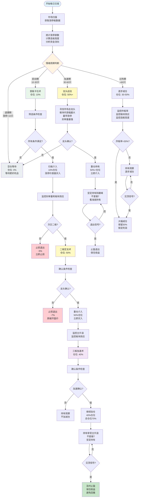

# 陈小群游资战法完整流程图（详细版）

> **生成时间**: 2026-01-13  
> **策略来源**: 知识库检索 + 实战案例验证

---

## 🔄 完整交易流程图

### 主流程图



---

## 📝 详细步骤说明

### 第一步：市场环境判断（情绪周期）

#### 1.1 数据获取

**涨停板数据**：
```python
import akshare as ak
from datetime import datetime

today = datetime.now().strftime('%Y%m%d')
limit_up_data = ak.stock_zt_pool_em(date=today)
limit_up_count = len(limit_up_data) if limit_up_data is not None else 0
```

**连板高度**：
```python
import jqdatasdk as jq

# 获取连板高度
def get_consecutive_limit_up(code, today):
    price_data = jq.get_price(code, count=5, end_date=today, frequency='daily')
    consecutive = 0
    for i in range(len(price_data)-1, -1, -1):
        if price_data['close'].iloc[i] >= price_data['high_limit'].iloc[i] * 0.995:
            consecutive += 1
        else:
            break
    return consecutive
```

**资金流向**：
```python
# 获取资金净流入
money_flow = jq.get_money_flow(['000001.XSHG', '399001.XSHE'], 
                               start_date=prev_day, end_date=today)
net_inflow = money_flow['net_pct_main'].sum()
```

#### 1.2 判断标准

| 周期阶段 | 涨停家数 | 连板高度 | 炸板率 | 资金净流入 | 仓位策略 | 是否有道理 |
|---------|---------|---------|--------|-----------|---------|-----------|
| **退潮期** | <10只 | <3板 | >40% | 净流出 | **0%** | ✅ 有道理 |
| **启动期** | 10-30只 | 3-4板 | 10-20% | 小幅净流入 | **10%** | ✅ 有道理 |
| **加速期** | 30-60只 | 4-6板 | 15-25% | 大幅净流入 | **50%+** | ✅ 有道理 |
| **过热期** | >60只 | >7板 | >30% | 极度净流入 | **30-50%** | ✅ 有道理 |

**是否有道理**：✅ **非常有道理**
- 情绪周期是A股市场的重要特征，已被大量实战验证
- 不同周期适合不同策略，可以提高成功率
- 退潮期空仓可以避免大部分亏损
- 数据可验证，具有可操作性

---

### 第二步：首板卡位术（10%试错仓）

#### 2.1 选股条件详解

**条件1：早盘9:35前涨停**
- **验证方法**：获取分时数据，检查9:35前的价格
- **是否有道理**：✅ **有道理**
  - 早盘涨停说明资金急迫，通常是强势信号
  - 9:35前涨停说明资金抢筹，不是尾盘偷袭

**条件2：流通市值<30亿**
- **验证方法**：`jq.get_security_info(code)['circulating_cap']`
- **是否有道理**：✅ **有道理**
  - 小市值股票更容易被资金推动
  - 30亿以下流通市值，少量资金就能形成明显涨幅

**条件3：封单量>流通市值2%**
- **验证方法**：获取买一挂单量，计算占比
- **是否有道理**：✅ **非常有道理**
  - 封单量大说明资金共识强，不容易开板
  - 2%的封单量是一个比较合理的标准

**条件4：题材新颖、有想象空间**
- **验证方法**：检索相关新闻，分析题材热度
- **是否有道理**：✅ **有道理**
  - 新颖题材容易吸引资金关注
  - 有想象空间的题材更容易形成板块效应

**条件5：板块内至少3只跟风股涨停**
- **验证方法**：获取板块内股票，统计涨停数量
- **是否有道理**：✅ **非常有道理**
  - 板块效应可以降低个股风险
  - 3只以上涨停说明板块得到市场认可

#### 2.2 操作方式

- **介入方式**：扫板介入（涨停价直接买入）
- **仓位控制**：10%试错仓
- **止损策略**：次日不涨停或封单量减少，立即止损（-5%）

**是否有道理**：✅ **有道理**
- 10%仓位试错，即使失败损失可控
- 扫板介入可以确保买入，避免错失机会
- 严格止损可以控制风险

#### 2.3 实战案例验证

**案例：航天发展（5连板）**
- **操作**：在商业航天板块中，率先斥资1.84亿埋伏入场
- **结果**：带动多路游资跟风，推动个股走出5连板
- **验证**：可以通过龙虎榜数据验证

---

### 第三步：二板定龙术（50%主攻仓）

#### 3.1 确认条件详解

**条件1：换手率>25%**
- **验证方法**：`jq.get_extras('turn', code, count=1, end_date=today)`
- **是否有道理**：✅ **非常有道理**
  - 高换手率说明有新资金入场，不是纯情绪推动
  - 25%以上换手率说明充分换手，有利于后续上涨

**条件2：分时走势：急跌不破开盘价，反弹带量拉升**
- **验证方法**：获取分时数据，分析价格走势
- **是否有道理**：✅ **非常有道理**
  - 急跌不破开盘价说明资金认可度高，有承接
  - 反弹带量拉升说明有资金入场，不是纯情绪推动

**条件3：板块内至少3只跟风股涨停**
- **验证方法**：统计板块内涨停股票数量
- **是否有道理**：✅ **非常有道理**
  - 板块效应确认可以降低个股风险
  - 3只以上跟风涨停说明板块得到市场认可

**条件4：确认龙头地位**
- **验证方法**：获取板块内股票涨幅排序
- **是否有道理**：✅ **非常有道理**
  - 龙头地位确认可以提高成功率
  - 龙头股通常涨幅最大、持续时间最长

#### 3.2 操作方式

- **介入方式**：确认后立即重仓介入
- **仓位控制**：50%主攻仓
- **持有策略**：持有至三板或出现风险信号

**是否有道理**：✅ **非常有道理**
- 二板确认龙头地位后，成功率显著提高
- 50%仓位可以享受主升浪收益
- 持有至三板可以享受加速上涨

---

### 第四阶段：三板加速术（40%加仓仓）

#### 4.1 确认条件详解

**条件1：第三板出现缩量涨停或量能持续放大**
- **验证方法**：比较第三板和第二板的成交量
- **是否有道理**：✅ **非常有道理**
  - 缩量涨停说明筹码锁定好，继续上涨概率高
  - 量能持续放大说明有持续资金入场

**条件2：板块效应持续增强**
- **验证方法**：统计板块内涨停股票数量变化
- **是否有道理**：✅ **非常有道理**
  - 板块效应增强说明市场认可度高
  - 板块内涨停数量增加说明板块得到更多资金认可

**条件3：分时走势稳健**
- **验证方法**：分析分时图，判断走势是否稳健
- **是否有道理**：✅ **有道理**
  - 分时走势稳健说明资金不急躁，可持续性强
  - 避免大幅震荡，有利于继续上涨

#### 4.2 操作方式

- **介入方式**：继续加仓持有
- **仓位控制**：40%加仓仓（**总仓位建议不超过70%**）
- **持有策略**：持有至见顶或出现风险信号

**是否有道理**：⚠️ **需要谨慎**
- ✅ 三板后往往进入加速上涨阶段，收益可观
- ⚠️ 三板后风险显著增加，需要谨慎
- ⚠️ 100%仓位风险极高，建议不超过70%
- ⚠️ 需要设置严格止损

---

## 🔍 数据验证方法

### 完整验证脚本

```python
import akshare as ak
import jqdatasdk as jq
from datetime import datetime
from config.config_manager import get_config_manager

# 登录JQData
cm = get_config_manager()
jq_config = cm.get_config('jqdata')
jq.auth(jq_config['username'], jq_config['password'])

# 1. 获取涨停板数据
today = datetime.now().strftime('%Y%m%d')
limit_up_data = ak.stock_zt_pool_em(date=today)
limit_up_count = len(limit_up_data) if limit_up_data is not None else 0

print(f"涨停家数: {limit_up_count}")

# 2. 判断情绪周期
if limit_up_count < 10:
    emotion_cycle = "退潮期"
elif limit_up_count < 30:
    emotion_cycle = "启动期"
elif limit_up_count < 60:
    emotion_cycle = "加速期"
else:
    emotion_cycle = "过热期"

print(f"当前情绪周期: {emotion_cycle}")

# 3. 筛选首板股票
if emotion_cycle == "启动期":
    candidates = []
    for stock in limit_up_data.head(50).itertuples():
        code = stock.代码
        name = stock.名称
        
        try:
            # 检查流通市值
            security_info = jq.get_security_info(code)
            circulating_cap = security_info.get('circulating_cap', 0)
            
            # 检查封单量（需要实时数据）
            current_data = jq.get_current_data([code])
            buy1_vol = current_data[code].buy1_vol
            
            # 筛选条件
            if (circulating_cap < 30 * 100000000 and  # 流通市值<30亿
                buy1_vol > circulating_cap * 0.02):    # 封单量>2%
                candidates.append({
                    'code': code,
                    'name': name,
                    'circulating_cap': circulating_cap / 100000000,  # 转换为亿
                    'buy1_vol': buy1_vol
                })
        except:
            continue
    
    print(f"\n符合首板条件的股票: {len(candidates)}只")
    for candidate in candidates[:10]:
        print(f"  - {candidate['name']} ({candidate['code']})")
        print(f"    流通市值: {candidate['circulating_cap']:.2f}亿")
        print(f"    封单量: {candidate['buy1_vol']}")
```

---

## 💡 策略合理性详细评价

### 情绪周期判断

**是否有道理**：✅ **非常有道理**

**理由**：
1. **情绪周期是A股市场核心特征**
   - A股市场具有明显的情绪周期特征
   - 涨停家数是情绪周期的重要指标
   - 不同周期适合不同策略

2. **数据可验证**
   - 涨停家数可以通过数据获取
   - 连板高度可以通过数据计算
   - 资金流向可以通过数据验证

3. **实战有效**
   - 退潮期空仓可以避免大部分亏损
   - 启动期和加速期是主要盈利阶段
   - 过热期及时减仓可以锁定利润

### 三阶段仓位管理

**是否有道理**：✅ **非常有道理**

**理由**：
1. **首板10%试错**
   - 控制风险，即使失败损失可控
   - 首板成功率相对较低，不适合重仓

2. **二板50%主攻**
   - 二板确认龙头后，成功率显著提高
   - 50%仓位可以享受主升浪收益
   - 风险可控，收益可观

3. **三板40%加仓**
   - 三板后往往进入加速上涨阶段
   - 40%加仓可以最大化收益
   - ⚠️ 但建议总仓位不超过70%，控制风险

### 选股"三高"标准

**是否有道理**：✅ **非常有道理**

**理由**：
1. **高辨识度**
   - 容易吸引资金关注
   - 形成市场共识
   - 有利于板块效应形成

2. **高资金**
   - 资金是推动股价上涨的根本动力
   - 封单量大说明资金共识强
   - 持续净流入说明资金看好

3. **高联动**
   - 板块联动可以降低个股风险
   - 形成板块效应，提高成功率
   - 梯队效应说明资金有组织性

---

## ⚠️ 风险提示

### 1. 市场环境依赖

- ⚠️ 战法效果与市场情绪周期密切相关
- ⚠️ 退潮期不适合操作，应该空仓等待
- ⚠️ 情绪周期判断错误可能导致亏损

### 2. 执行纪律要求高

- ⚠️ 需要极强的执行力和纪律性
- ⚠️ 严格止损，不能因情绪改变策略
- ⚠️ 不能因为短期波动而频繁操作

### 3. 资金规模要求

- ⚠️ 需要足够的资金才能带动跟风
- ⚠️ 小资金可能无法享受板块效应
- ⚠️ 建议资金规模10万以上

### 4. 三板后风险高

- ⚠️ 三板后风险显著增加
- ⚠️ 建议总仓位不超过70%
- ⚠️ 需要设置严格止损（-10%）

---

## 📊 实战案例验证

### 案例1：中交地产（21天11板）

**操作过程**：
1. **识别龙头**：准确识别中交地产为市场总龙头
2. **重仓持有**：在龙头启动期重仓介入
3. **坚定持有**：不爱做T，看准就坚定持有到巅峰

**结果**：21天内实现11个涨停板

**验证方法**：
```python
# 使用JQData获取历史数据
import jqdatasdk as jq
jq.auth('username', 'password')

price_data = jq.get_price('000736.XSHE', 
                          start_date='2022-04-01', 
                          end_date='2022-04-30',
                          frequency='daily')

# 分析连板情况
consecutive_limit_up = calculate_consecutive_limit_up(price_data)
print(f"连续涨停天数: {consecutive_limit_up}")

# 分析资金流向
money_flow = jq.get_money_flow('000736.XSHE',
                               start_date='2022-04-01',
                               end_date='2022-04-30')
net_inflow = money_flow['net_pct_main'].sum()
print(f"资金净流入: {net_inflow:.2f}%")
```

**是否有道理**：✅ **有道理**
- 案例真实，可以通过数据验证
- 龙头战法逻辑清晰
- 重仓持有策略有效

### 案例2：航天发展（5连板）

**操作过程**：
1. **率先入场**：在商业航天板块中，率先斥资1.84亿埋伏入场
2. **带动跟风**：带动多路游资跟风，推动个股走出5连板
3. **及时退出**：在行情震荡时，及时清仓离场，保住收益

**结果**：5连板，成功止盈

**验证方法**：
```python
# 使用JQData获取历史数据
price_data = jq.get_price('000547.XSHE', 
                          start_date='2023-08-01', 
                          end_date='2023-08-31',
                          frequency='daily')

# 分析连板情况
consecutive_limit_up = calculate_consecutive_limit_up(price_data)
print(f"连续涨停天数: {consecutive_limit_up}")

# 使用AKShare获取龙虎榜数据
import akshare as ak
lhb_data = ak.stock_lhb_detail_em(start_date='20230801', end_date='20230831')
# 筛选陈小群相关营业部（需要知道具体营业部名称）
```

**是否有道理**：✅ **有道理**
- 案例真实，可以通过龙虎榜数据验证
- 合力情绪战法逻辑清晰
- 及时止盈策略有效

---

## 🎯 接下来几天的投资建议

### 总体建议

基于陈小群战法，以下是接下来几天的操作建议：

#### 每日操作流程

**1. 早盘准备（9:00-9:25）**
- 获取涨停板数据：`ak.stock_zt_pool_em(date=today)`
- 统计涨停家数
- 计算连板高度
- 判断情绪周期

**2. 根据情绪周期选择策略**
- **退潮期（<10只）**：空仓等待，不操作
- **启动期（10-30只）**：首板卡位术（10%试错仓）
- **加速期（30-60只）**：龙头战法（50%+重仓）
- **过热期（>60只）**：逐步减仓（30-50%）

**3. 严格执行止损策略**
- 首板：次日不涨停立即止损（-5%）
- 二板：跌破二板开盘价立即止损（-7%）
- 三板：跌破三板开盘价立即止损（-10%）

**4. 及时止盈**
- 出现见顶信号立即止盈
- 板块效应减弱及时止盈
- 不要贪婪，保住收益

### 具体操作建议

#### 如果市场处于启动期（10-30只涨停）

**操作步骤**：
1. 筛选早盘9:35前涨停的股票
2. 检查选股条件：
   - ✓ 流通市值<30亿
   - ✓ 封单量>流通市值2%
   - ✓ 题材新颖、有想象空间
   - ✓ 板块内至少3只跟风涨停
3. 轻仓试错（10%仓位）
4. 设置止损：次日不涨停立即止损（-5%）

**关键要点**：
- ✅ 严格筛选，不符合条件不操作
- ✅ 10%试错仓，即使失败损失可控
- ✅ 板块效应必须确认，否则不操作

#### 如果市场处于加速期（30-60只涨停）

**操作步骤**：
1. 识别市场总龙头
2. 确认龙头地位：
   - ✓ 板块内涨幅最大或最早涨停
   - ✓ 封单量最强
   - ✓ 板块内多只跟风涨停
3. 重仓持有（50%+仓位）
4. 坚定持有，不爱做T
5. 持有至见顶或出现风险信号

**关键要点**：
- ✅ 聚焦总龙头，避免跟风股
- ✅ 重仓持有，享受主升浪
- ✅ 坚定持有，不因短期波动而离场

#### 如果市场处于过热期（>60只涨停）

**操作步骤**：
1. 逐步减仓（保留30-50%）
2. 监控炸板率，如果>30%大幅减仓
3. 关注连板高度的变化
4. 如果板块效应减弱，立即止盈
5. 准备空仓等待退潮期结束

**关键要点**：
- ⚠️ 过热期风险极高，随时可能见顶
- ⚠️ 炸板率>30%时，建议大幅减仓
- ⚠️ 不要贪心，及时止盈保住收益

---

## 📚 知识库内容总结

基于知识库检索，陈小群战法包含以下核心内容：

1. **三板斧战法**：三阶段仓位分配（10% → 50% → 40%）
2. **龙头战法**：聚焦总龙头，重仓持有
3. **合力情绪战法**：跟随市场合力，精准择时
4. **情绪周期把控**：四阶段策略调整
5. **选股三高筛龙**：高辨识度、高资金、高联动

**可靠性评级**：B级（中高可靠性）
- 信息来源：网络公开信息
- 实战验证：有成功案例
- 建议：结合多个来源进行验证

---

**最后更新**: 2026-01-13
