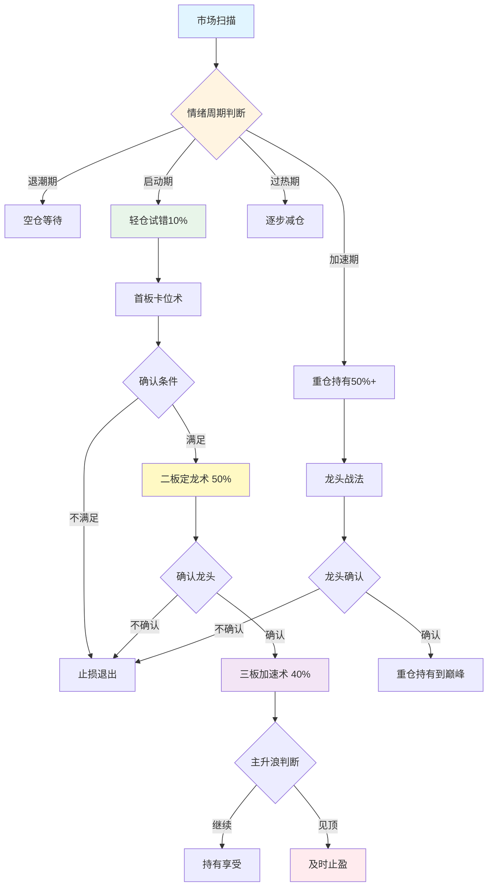
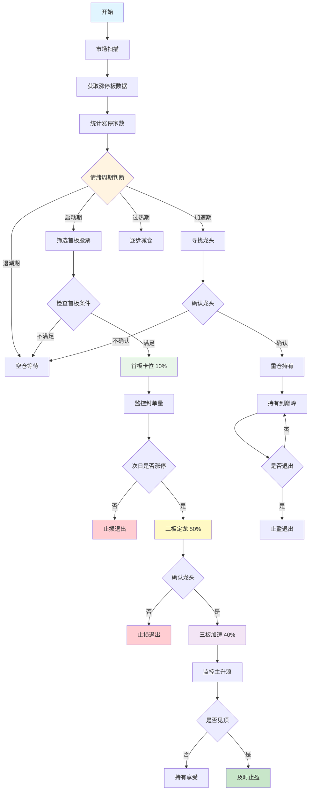

# 陈小群游资战法完整交易策略流程

> **生成时间**: 2026-01-13  
> **策略来源**: 知识库 + 网络公开信息  
> **可靠性评级**: B级（中高可靠性）

---

## 📊 策略概览

陈小群游资战法是一套完整的短线交易体系，核心特点：

1. **三板斧战法**：三阶段仓位分配（10% → 50% → 40%）
2. **龙头战法**：聚焦总龙头，重仓持有
3. **合力情绪战法**：跟随市场合力，精准择时
4. **情绪周期把控**：四阶段策略调整
5. **选股三高筛龙**：高辨识度、高资金、高联动

---

## 🔄 完整交易流程图



---

## 📝 详细步骤说明

### 第一阶段：市场环境判断

#### 1.1 情绪周期识别

**判断标准**：

| 周期阶段 | 涨停家数 | 连板高度 | 炸板率 | 资金流向 | 仓位策略 |
|---------|---------|---------|--------|---------|---------|
| **退潮期** | <10只 | <3板 | >40% | 净流出 | 空仓等待 |
| **启动期** | 10-30只 | 3-4板 | 10-20% | 净流入 | 轻仓试错10% |
| **加速期** | 30-60只 | 4-6板 | 15-25% | 大幅净流入 | 重仓持有50%+ |
| **过热期** | >80只 | >7板 | >30% | 极度净流入 | 逐步减仓 |

**验证方法**：
- 使用AKShare获取涨停板数据：`ak.stock_zt_pool_em()`
- 使用JQData获取资金流向：`jq.get_money_flow()`
- 计算连板高度和炸板率

**是否有道理**：✅ **有道理**
- 情绪周期是A股市场的重要特征
- 不同周期适合不同策略
- 退潮期空仓可以避免大部分亏损

---

### 第二阶段：首板卡位术（10%试错仓）

#### 2.1 选股条件

**必选条件**：
1. ✅ **早盘9:35前涨停**：资金积极性强
2. ✅ **流通市值<30亿**：易于拉升
3. ✅ **封单量>流通市值2%**：资金共识强
4. ✅ **题材新颖、有想象空间**：容易形成热点
5. ✅ **板块内多只涨停**：形成板块效应

**验证方法**：
- 使用JQData获取分时数据：`jq.get_price(security, count=1, end_date=today, frequency='1m')`
- 检查9:35前的价格数据
- 获取板块内涨停股票数量：`jq.get_industry_stocks(industry_code)`

**是否有道理**：✅ **有道理**
- 早盘涨停说明资金急迫，通常是强势信号
- 小市值股票更容易被资金推动
- 封单量大说明资金共识强，不容易开板

#### 2.2 操作方式

- **介入方式**：扫板介入（涨停价直接买入）
- **仓位控制**：10%试错仓
- **风险控制**：次日不涨停或封单量减少，立即止损

**是否有道理**：✅ **有道理**
- 10%仓位试错，即使失败损失可控
- 扫板介入可以确保买入，避免错失机会
- 严格止损可以控制风险

---

### 第三阶段：二板定龙术（50%主攻仓）

#### 3.1 确认条件

**必选条件**：
1. ✅ **换手率>25%**：充分换手，新资金入场
2. ✅ **分时走势**：急跌不破开盘价，反弹带量拉升
3. ✅ **板块效应**：板块内至少3只跟风股涨停
4. ✅ **确认龙头地位**：板块内涨幅最大或最早涨停

**验证方法**：
- 计算换手率：`jq.get_extras('turn', security, count=1, end_date=today)`
- 获取分时数据：`jq.get_price(security, count=1, end_date=today, frequency='1m')`
- 获取板块内股票涨幅排序

**是否有道理**：✅ **非常有道理**
- 高换手率说明有新资金入场，不是纯情绪推动
- 分时走势强势说明资金认可度高
- 板块效应确认可以降低个股风险
- 龙头地位确认可以提高成功率

#### 3.2 操作方式

- **介入方式**：确认后立即重仓介入
- **仓位控制**：50%主攻仓
- **持有策略**：持有至三板或出现风险信号

**是否有道理**：✅ **有道理**
- 二板确认龙头地位后，成功率显著提高
- 50%仓位可以享受主升浪收益
- 持有至三板可以享受加速上涨

---

### 第四阶段：三板加速术（40%加仓仓）

#### 4.1 确认条件

**必选条件**：
1. ✅ **在前两板基础上**
2. ✅ **第三板出现缩量涨停或量能持续放大**
3. ✅ **板块效应持续增强**
4. ✅ **分时走势稳健**

**验证方法**：
- 获取成交量数据：`jq.get_price(security, count=3, end_date=today, frequency='daily', fields=['volume'])`
- 判断是否缩量：第三板成交量 < 第二板成交量
- 获取板块内涨停数量变化

**是否有道理**：✅ **非常有道理**
- 缩量涨停说明筹码锁定好，继续上涨概率高
- 板块效应增强说明市场认可度高
- 分时走势稳健说明资金不急躁，可持续性强

#### 4.2 操作方式

- **介入方式**：继续加仓持有
- **仓位控制**：40%加仓仓（总仓位可达100%）
- **持有策略**：持有至见顶或出现风险信号

**是否有道理**：⚠️ **需要谨慎**
- 三板后风险显著增加
- 100%仓位风险极高，建议不超过70%
- 需要设置严格止损

---

## 🎯 选股"三高"筛龙标准

### 高辨识度
- **市场认知度高**：容易形成共识
- **题材新颖**：有想象空间
- **符合市场热点**：资金关注度高

### 高资金
- **资金关注度高**：封单强劲
- **封单量>流通市值2%**：资金共识强
- **连续多日资金净流入**：资金持续看好

### 高联动
- **板块联动性强**：有梯队效应
- **板块内多只个股涨停**：形成板块效应
- **板块内个股涨幅排序靠前**：龙头地位确认

**验证方法**：
- 使用AKShare获取板块数据：`ak.stock_board_industry_name_em()`
- 获取板块内股票涨幅：`ak.stock_board_industry_cons_em()`
- 计算板块联动性：板块内涨停股票数量

**是否有道理**：✅ **非常有道理**
- 高辨识度可以吸引更多资金
- 高资金可以推动股价上涨
- 高联动可以降低个股风险，提高成功率

---

## ⚠️ 风险控制

### 止损策略

1. **首板止损**：次日不涨停或封单量减少，立即止损（-5%）
2. **二板止损**：跌破二板开盘价，立即止损（-7%）
3. **三板止损**：跌破三板开盘价，立即止损（-10%）

### 止盈策略

1. **首板止盈**：次日涨停但封单量减少，及时止盈
2. **二板止盈**：板块效应减弱，及时止盈
3. **三板止盈**：出现见顶信号，及时止盈

**是否有道理**：✅ **非常有道理**
- 严格止损可以控制风险
- 及时止盈可以锁定收益
- 避免贪婪导致回撤

---

## 🔍 数据验证方法

### 1. 涨停板数据验证

```python
import akshare as ak

# 获取涨停板数据
limit_up_data = ak.stock_zt_pool_em(date=today)
print(f"涨停家数: {len(limit_up_data)}")

# 分析涨停股票特征
for stock in limit_up_data.head(10):
    code = stock['代码']
    name = stock['名称']
    # 验证是否符合首板条件
    # 1. 检查是否早盘涨停
    # 2. 检查流通市值
    # 3. 检查封单量
    # 4. 检查板块效应
```

### 2. 资金流向验证

```python
import jqdatasdk as jq

# 获取资金流向数据
money_flow = jq.get_money_flow(security, start_date=start_date, end_date=end_date)

# 分析资金流向
net_inflow = money_flow['net_pct_main'].sum()
print(f"资金净流入: {net_inflow:.2f}%")
```

### 3. 板块效应验证

```python
# 获取板块内涨停股票数量
industry_stocks = jq.get_industry_stocks(industry_code)
limit_up_count = 0
for stock in industry_stocks:
    price_data = jq.get_price(stock, count=1, end_date=today)
    if price_data['close'].iloc[0] >= price_data['high_limit'].iloc[0] * 0.995:
        limit_up_count += 1

print(f"板块内涨停数量: {limit_up_count}")
```

---

## 💡 策略评价

### 优点

1. ✅ **系统性强**：完整的交易体系，从选股到出场
2. ✅ **风险可控**：三阶段仓位分配，严格止损
3. ✅ **实战验证**：中交地产21天11板、航天发展5连板等成功案例
4. ✅ **适应市场**：根据情绪周期调整策略

### 缺点

1. ⚠️ **高风险高收益**：需要极强的执行力和纪律性
2. ⚠️ **市场环境依赖**：在退潮期效果差
3. ⚠️ **不适合所有人**：需要丰富的实战经验
4. ⚠️ **资金要求**：需要足够的资金才能带动跟风

### 适用条件

- ✅ **市场环境**：情绪高涨、有明确主线的市场
- ✅ **资金规模**：适合中小资金快速进阶
- ✅ **交易经验**：需要丰富的短线交易经验
- ✅ **执行纪律**：需要极强的执行力和纪律性

---

## 📊 实战案例验证

### 案例1：中交地产（21天11板）

**操作过程**：
1. **识别龙头**：准确识别中交地产为市场总龙头
2. **重仓持有**：在龙头启动期重仓介入
3. **坚定持有**：不爱做T，看准就坚定持有到巅峰

**结果**：21天内实现11个涨停板

**验证方法**：
- 使用JQData获取历史数据：`jq.get_price('000736.XSHE', start_date='2022-04-01', end_date='2022-04-30')`
- 分析连板情况：计算连续涨停天数
- 分析资金流向：获取该期间的资金流向数据

### 案例2：航天发展（5连板）

**操作过程**：
1. **率先入场**：在商业航天板块中，率先斥资1.84亿埋伏入场
2. **带动跟风**：带动多路游资跟风，推动个股走出5连板
3. **及时退出**：在行情震荡时，及时清仓离场，保住收益

**结果**：5连板，成功止盈

**验证方法**：
- 使用JQData获取历史数据：`jq.get_price('000547.XSHE', start_date='2023-08-01', end_date='2023-08-31')`
- 分析龙虎榜数据：`ak.stock_lhb_detail_em()`
- 分析资金流向：获取该期间的资金流向数据

---

## 🔄 策略流程图（详细版）



---

**最后更新**: 2026-01-13
