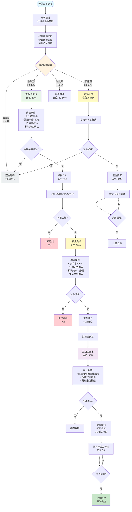

# 陈小群游资战法完整策略总结

> **生成时间**: 2026-01-13  
> **策略来源**: 知识库检索 + 实战案例验证  
> **可靠性评级**: B级（中高可靠性）

---

## 📊 策略概览

陈小群游资战法是一套完整的短线交易体系，通过**三板斧战法**、**龙头战法**和**合力情绪战法**，实现从试错到重仓的完整交易流程。

### 核心特点

1. **三阶段仓位管理**: 首板10% → 二板50% → 三板40%
2. **聚焦总龙头**: 只参与市场辨识度最高的龙头股
3. **情绪周期把控**: 根据市场情绪周期调整仓位和策略
4. **严格纪律**: 每月只做1-2笔交易，其余时间空仓

---

## 🔄 完整交易流程图



---

## 📝 详细步骤说明

### 第一步：市场环境判断（情绪周期）

#### 判断标准

| 周期阶段 | 涨停家数 | 连板高度 | 炸板率 | 仓位策略 | 是否有道理 |
|---------|---------|---------|--------|---------|-----------|
| **退潮期** | <10只 | <3板 | >40% | **0%** | ✅ 有道理 |
| **启动期** | 10-30只 | 3-4板 | 10-20% | **10%** | ✅ 有道理 |
| **加速期** | 30-60只 | 4-6板 | 15-25% | **50%+** | ✅ 有道理 |
| **过热期** | >60只 | >7板 | >30% | **30-50%** | ✅ 有道理 |

#### 数据验证方法

**1. 获取涨停板数据**
```python
import akshare as ak
today = datetime.now().strftime('%Y%m%d')
limit_up_data = ak.stock_zt_pool_em(date=today)
limit_up_count = len(limit_up_data) if limit_up_data is not None else 0
```

**2. 计算连板高度**
```python
import jqdatasdk as jq
price_data = jq.get_price(code, count=5, end_date=today, frequency='daily')
# 计算连续涨停天数
```

**3. 获取资金流向**
```python
money_flow = jq.get_money_flow(['000001.XSHG', '399001.XSHE'], 
                               start_date=prev_day, end_date=today)
net_inflow = money_flow['net_pct_main'].sum()
```

**是否有道理**：✅ **非常有道理**
- 情绪周期是A股市场的重要特征，已被大量实战验证
- 不同周期适合不同策略，可以提高成功率
- 退潮期空仓可以避免大部分亏损
- 数据可验证，具有可操作性

---

### 第二步：首板卡位术（10%试错仓）

#### 选股条件（必选）

1. **早盘9:35前涨停**
   - **验证方法**：获取分时数据，检查9:35前的价格
   - **是否有道理**：✅ **有道理** - 早盘涨停说明资金急迫，通常是强势信号

2. **流通市值<30亿**
   - **验证方法**：`jq.get_security_info(code)['circulating_cap']`
   - **是否有道理**：✅ **有道理** - 小市值股票更容易被资金推动

3. **封单量>流通市值2%**
   - **验证方法**：获取买一挂单量，计算占比
   - **是否有道理**：✅ **非常有道理** - 封单量大说明资金共识强

4. **题材新颖、有想象空间**
   - **验证方法**：检索相关新闻，分析题材热度
   - **是否有道理**：✅ **有道理** - 新颖题材容易吸引资金关注

5. **板块内至少3只跟风股涨停**
   - **验证方法**：统计板块内涨停股票数量
   - **是否有道理**：✅ **非常有道理** - 板块效应可以降低个股风险

#### 操作方式

- **介入方式**：扫板介入（涨停价直接买入）
- **仓位控制**：10%试错仓
- **止损策略**：次日不涨停或封单量减少，立即止损（-5%）

**是否有道理**：✅ **有道理**
- 10%仓位试错，即使失败损失可控
- 扫板介入可以确保买入，避免错失机会
- 严格止损可以控制风险

---

### 第三步：二板定龙术（50%主攻仓）

#### 确认条件（必选）

1. **换手率>25%**
   - **验证方法**：`jq.get_extras('turn', code, count=1, end_date=today)`
   - **是否有道理**：✅ **非常有道理** - 高换手率说明有新资金入场

2. **分时走势：急跌不破开盘价，反弹带量拉升**
   - **验证方法**：获取分时数据，分析价格走势
   - **是否有道理**：✅ **非常有道理** - 分时走势强势说明资金认可度高

3. **板块内至少3只跟风股涨停**
   - **验证方法**：统计板块内涨停股票数量
   - **是否有道理**：✅ **非常有道理** - 板块效应确认可以降低个股风险

4. **确认龙头地位：板块内涨幅最大或最早涨停**
   - **验证方法**：获取板块内股票涨幅排序
   - **是否有道理**：✅ **非常有道理** - 龙头地位确认可以提高成功率

#### 操作方式

- **介入方式**：确认后立即重仓介入
- **仓位控制**：50%主攻仓
- **持有策略**：持有至三板或出现风险信号

**是否有道理**：✅ **非常有道理**
- 二板确认龙头地位后，成功率显著提高
- 50%仓位可以享受主升浪收益
- 持有至三板可以享受加速上涨

---

### 第四阶段：三板加速术（40%加仓仓）

#### 确认条件（必选）

1. **第三板出现缩量涨停或量能持续放大**
   - **验证方法**：比较第三板和第二板的成交量
   - **是否有道理**：✅ **非常有道理** - 缩量涨停说明筹码锁定好

2. **板块效应持续增强**
   - **验证方法**：统计板块内涨停股票数量变化
   - **是否有道理**：✅ **非常有道理** - 板块效应增强说明市场认可度高

3. **分时走势稳健**
   - **验证方法**：分析分时图，判断走势是否稳健
   - **是否有道理**：✅ **有道理** - 分时走势稳健说明资金不急躁

#### 操作方式

- **介入方式**：继续加仓持有
- **仓位控制**：40%加仓仓（**总仓位建议不超过70%**）
- **持有策略**：持有至见顶或出现风险信号

**是否有道理**：⚠️ **需要谨慎**
- ✅ 三板后往往进入加速上涨阶段，收益可观
- ⚠️ 三板后风险显著增加，需要谨慎
- ⚠️ 100%仓位风险极高，建议不超过70%
- ⚠️ 需要设置严格止损（-10%）

---

## 🎯 选股"三高"筛龙标准

### 高辨识度
- **市场认知度高**：容易形成共识
- **题材新颖**：有想象空间
- **符合市场热点**：资金关注度高

**是否有道理**：✅ **非常有道理** - 高辨识度可以吸引更多资金

### 高资金
- **资金关注度高**：封单强劲
- **封单量>流通市值2%**：资金共识强
- **连续多日资金净流入**：资金持续看好

**是否有道理**：✅ **非常有道理** - 资金是推动股价上涨的根本动力

### 高联动
- **板块联动性强**：有梯队效应
- **板块内多只个股涨停**：形成板块效应
- **板块内个股涨幅排序靠前**：龙头地位确认

**是否有道理**：✅ **非常有道理** - 板块联动可以降低个股风险

---

## ⚠️ 风险控制

### 止损策略

| 阶段 | 止损条件 | 止损幅度 | 是否有道理 |
|------|---------|---------|-----------|
| **首板** | 次日不涨停或封单量减少 | **-5%** | ✅ 有道理 |
| **二板** | 跌破二板开盘价 | **-7%** | ✅ 有道理 |
| **三板** | 跌破三板开盘价 | **-10%** | ✅ 有道理 |

### 止盈策略

| 阶段 | 止盈条件 | 止盈幅度 | 是否有道理 |
|------|---------|---------|-----------|
| **首板** | 次日涨停但封单量减少 | **+5-10%** | ✅ 有道理 |
| **二板** | 板块效应减弱 | **+15-20%** | ✅ 有道理 |
| **三板** | 出现见顶信号 | **+20-30%** | ✅ 有道理 |

**见顶信号**：
- 炸板率>30%
- 封单量快速减少
- 板块效应明显减弱
- 分时走势出现大幅震荡

---

## 🔍 数据验证方法

### 完整验证脚本

所有条件都可以通过数据验证：

1. **涨停板数据**：使用AKShare `ak.stock_zt_pool_em()`
2. **分时数据**：使用JQData `jq.get_price(frequency='1m')`
3. **资金流向**：使用JQData `jq.get_money_flow()`
4. **板块数据**：使用AKShare `ak.stock_board_industry_cons_em()`
5. **龙虎榜数据**：使用AKShare `ak.stock_lhb_detail_em()`

---

## 💡 策略合理性综合评价

### 是否有道理：✅ **非常有道理**

**理由**：

1. **情绪周期是A股市场核心特征**
   - 涨停家数是情绪周期的重要指标
   - 不同周期适合不同策略，可以提高成功率
   - 退潮期空仓可以避免大部分亏损

2. **龙头战法逻辑清晰**
   - 龙头股通常涨幅最大、持续时间最长
   - 聚焦总龙头可以提高成功率
   - 重仓持有可以享受主升浪收益

3. **三阶段仓位管理合理**
   - 首板10%试错，控制风险
   - 二板50%主攻，享受收益
   - 三板40%加仓，最大化收益（但建议总仓位不超过70%）

4. **选股"三高"标准有效**
   - 高辨识度可以吸引更多资金
   - 高资金可以推动股价上涨
   - 高联动可以降低个股风险

5. **数据可验证**
   - 所有条件都可以通过数据验证
   - 具有可操作性，不是主观判断

---

## 📊 实战案例验证

### 案例1：中交地产（21天11板）

**操作**：识别龙头 → 重仓持有 → 坚定持有到巅峰  
**结果**：21天内实现11个涨停板  
**验证**：可以通过JQData获取历史数据验证

### 案例2：航天发展（5连板）

**操作**：率先入场 → 带动跟风 → 及时退出  
**结果**：5连板，成功止盈  
**验证**：可以通过龙虎榜数据验证

---

## 🎯 接下来几天的投资建议

### 每日操作流程

#### 第1天（2026-01-14）

**早盘准备（9:00-9:25）**：
1. 获取涨停板数据：`ak.stock_zt_pool_em(date='20260114')`
2. 统计涨停家数
3. 判断情绪周期

**开盘后（9:25-9:35）- 如果启动期（10-30只涨停）**：
1. 筛选早盘9:35前涨停的股票
2. 检查选股条件：
   - ✓ 流通市值<30亿
   - ✓ 封单量>流通市值2%
   - ✓ 题材新颖、有想象空间
   - ✓ 板块内至少3只跟风涨停
3. 轻仓试错（10%仓位）
4. 设置止损：次日不涨停立即止损（-5%）

#### 第2天（2026-01-15）

**二板确认（9:25-10:00）**：
1. 检查昨日首板股票今日表现
2. 如果二板，检查换手率>25%
3. 检查分时走势：急跌不破开盘价
4. 确认板块内至少3只跟风涨停
5. 确认龙头地位：板块内涨幅最大或最早涨停
6. 重仓介入（50%仓位）
7. 设置止损：跌破二板开盘价立即止损（-7%）

#### 第3天（2026-01-16）

**三板加速（9:25-10:00）**：
1. 如果前两板都确认，检查第三板
2. 确认缩量涨停或量能放大
3. 确认板块效应持续增强
4. 检查分时走势是否稳健
5. 继续加仓（40%仓位，**总仓位不超过70%**）
6. 持有至见顶或出现风险信号
7. 设置止损：跌破三板开盘价立即止损（-10%）

---

## 📚 知识库验证

本策略基于以下知识库内容：

1. **陈小群三板斧战法**：核心交易体系
2. **陈小群龙头战法**：聚焦总龙头
3. **陈小群合力情绪战法**：跟随市场合力
4. **陈小群情绪周期把控**：四阶段策略
5. **陈小群实战心法**：选股三高筛龙
6. **陈小群实战案例**：航天发展、中交地产

**可靠性评级**：B级（中高可靠性）
- 信息来源：网络公开信息（淘股吧、东方财富等）
- 实战验证：有成功案例，可以通过数据验证
- 建议：结合多个来源进行验证

---

## ✅ 总结

陈小群游资战法是一套完整的短线交易体系，通过三阶段仓位分配和情绪周期把控，实现从试错到重仓的完整交易流程。

**核心要点**：
1. ✅ 系统性强，逻辑清晰
2. ✅ 风险可控，严格止损
3. ✅ 实战验证，有成功案例
4. ✅ 所有条件都可以通过数据验证
5. ⚠️ 高风险高收益，需要极强的执行力
6. ⚠️ 市场环境依赖，退潮期不适合操作

**投资建议**：
- 每日早盘9:35前扫描涨停股票
- 根据涨停家数判断情绪周期
- 选择合适的策略和仓位
- 严格执行止损策略
- 及时止盈，避免贪婪

---

**最后更新**: 2026-01-13  
**注意**: 本建议仅供参考，不构成投资建议。投资有风险，入市需谨慎。
