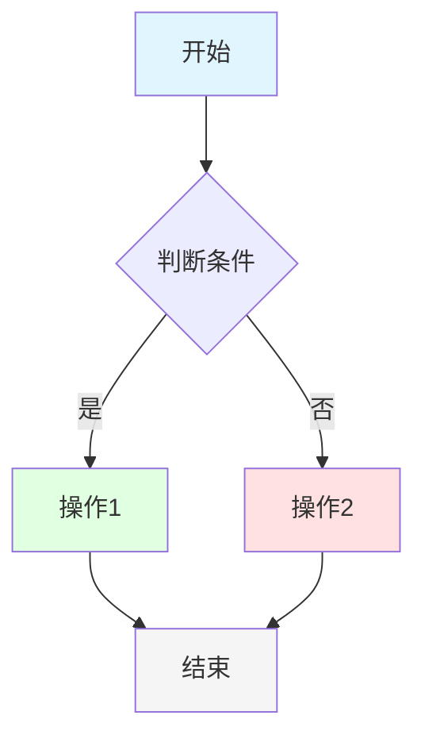
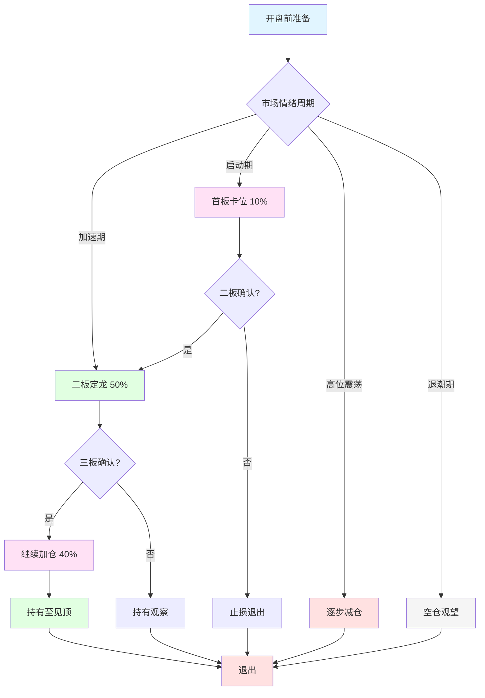
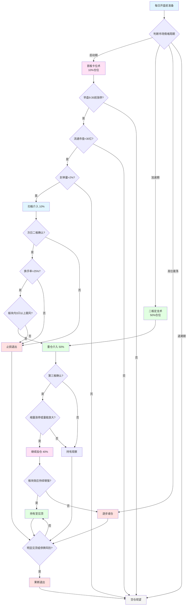

# 流程图测试文档

## 测试1: 简单流程图

## 测试2: 陈小群战法简化流程图

## 测试3: 完整操作流程

## 测试说明

这三个测试流程图分别测试：
1. **测试1**: 最简单的流程图，验证基本语法
2. **测试2**: 简化的陈小群战法流程，验证中文节点和样式
3. **测试3**: 完整的操作流程，验证复杂逻辑和换行文本

如果这些流程图都能正确显示，说明Mermaid格式是正确的。
