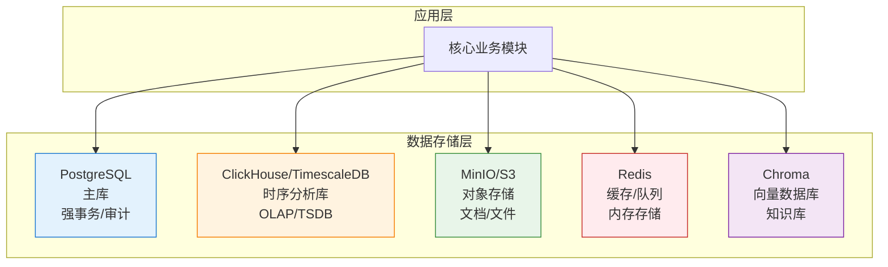

# 🗄️ 1.9 数据库架构设计

> **核心摘要：**
> 
> 本节详细介绍TRQuant系统的数据库架构设计，采用**分层/多存储（Polyglot Persistence）**架构，根据数据类型选择最适合的存储方案。通过理解PostgreSQL主库、ClickHouse/TimescaleDB时序库、MinIO/S3对象存储、Redis缓存等技术的选型理由和数据分布策略，帮助开发者理解系统的数据存储架构和设计决策。

## 📋 章节概览

<script>
function scrollToSection(sectionId) {
  const element = document.getElementById(sectionId);
  if (element) {
    const headerOffset = 100;
    const elementPosition = element.getBoundingClientRect().top;
    const offsetPosition = elementPosition + window.pageYOffset - headerOffset;
    window.scrollTo({
      top: offsetPosition,
      behavior: 'smooth'
    });
  }
}
</script>

<div class="section-overview">
  <div class="section-item" onclick="scrollToSection('section-1-9-1')">
    <h4>🎯 1.9.1 架构设计理念</h4>
    <p>分层/多存储架构的核心思想</p>
  </div>
  <div class="section-item" onclick="scrollToSection('section-1-9-2')">
    <h4>📊 1.9.2 数据类型分析</h4>
    <p>强事务、时序分析、文档存储等数据类型</p>
  </div>
  <div class="section-item" onclick="scrollToSection('section-1-9-3')">
    <h4>🗄️ 1.9.3 PostgreSQL主库</h4>
    <p>强事务/强审计类数据存储</p>
  </div>
  <div class="section-item" onclick="scrollToSection('section-1-9-4')">
    <h4>⏱️ 1.9.4 时序分析库</h4>
    <p>ClickHouse vs TimescaleDB选型</p>
  </div>
  <div class="section-item" onclick="scrollToSection('section-1-9-5')">
    <h4>📦 1.9.5 对象存储</h4>
    <p>MinIO/S3文档和文件存储</p>
  </div>
  <div class="section-item" onclick="scrollToSection('section-1-9-6')">
    <h4>⚡ 1.9.6 Redis缓存</h4>
    <p>缓存和任务队列</p>
  </div>
  <div class="section-item" onclick="scrollToSection('section-1-9-7')">
    <h4>🚀 1.9.7 实施路线图</h4>
    <p>分阶段实施策略</p>
  </div>
</div>

<h2 id="section-1-9-1">🎯 1.9.1 架构设计理念</h2>

### 核心理念：分层/多存储（Polyglot Persistence）

TRQuant系统采用**分层/多存储（Polyglot Persistence）**架构，根据数据类型的特点选择最适合的存储方案，而不是"单库打天下"。

### 设计决策：为什么选择多存储架构？

**决策**：采用Polyglot Persistence（多存储）架构，而非单一数据库

**背景**：
- 系统需要存储多种类型的数据（事务数据、时序数据、对象存储、缓存、向量数据）
- 不同数据类型有不同的访问模式和性能要求
- 需要支持"投研 + 回测 + 实盘风控 + 审计"的机构级闭环

**考虑因素**：

1. **数据特性差异**：
   - **事务数据**：需要ACID保证、强一致性、复杂查询（PostgreSQL）
   - **时序数据**：需要高效聚合、时间序列查询（ClickHouse/TimescaleDB）
   - **大文件**：需要对象存储、成本优化（MinIO/S3）
   - **实时数据**：需要高速访问、低延迟（Redis）
   - **向量数据**：需要相似度搜索（Chroma）

2. **性能要求**：
   - **事务数据**：强一致性优先，查询性能次之
   - **时序数据**：查询性能优先，写入性能次之
   - **对象存储**：存储成本优先，访问速度次之
   - **缓存**：访问速度优先，数据持久性次之

3. **成本考虑**：
   - **单一数据库方案**：简单但性能受限，难以优化
   - **多存储方案**：复杂但性能最优，每种数据使用最适合的存储

**决策**：选择多存储架构

**后果**：
- ✅ **优点**：
  - 每种数据使用最适合的存储，性能最优
  - 可以针对不同数据类型进行独立优化
  - 支持水平扩展，提高系统容量
- ❌ **缺点**：
  - 需要管理多个数据库，复杂度增加
  - 数据一致性需要额外考虑（跨库事务）
  - 运维成本增加
- 📝 **缓解措施**：
  - 统一数据访问接口，封装存储细节
  - 使用事务管理器处理跨库事务
  - 建立完善的监控和运维体系

### 设计原则

1. **按数据类型选择存储**：强事务数据用PostgreSQL，时序数据用时序库，文档用对象存储
2. **机构级闭环目标**：支持"投研 + 回测 + 实盘风控 + 审计"的完整闭环
3. **强一致性与可审计性**：关键业务数据必须保证强一致性和可追溯性
4. **性能与成本平衡**：在满足业务需求的前提下，优化性能和成本

### 架构总览



<h2 id="section-1-9-2">📊 1.9.2 数据类型分析</h2>

### A. 强事务/强审计类（典型 OLTP）

**数据特点**：
- 需要ACID事务保证
- 需要强一致性
- 需要外键关系、联表查询
- 需要约束和可审计性

**数据内容**：
- **策略仓库**：策略元数据、版本、作者、上线记录、参数集、回测任务定义
- **审批流**：策略评审、风控审批、上线/停机审批、变更记录
- **实盘账务**：账户、订单、成交、持仓、资金流水、对账差异
- **审计日志**：谁在什么时候做了什么（不可篡改、可追溯）
- **权限管理**：用户、角色、权限配置

**存储选择**：➡️ **PostgreSQL**（成熟ACID、强约束、SQL生态、审计与权限体系好做）

### B. 时间序列/分析类（典型 OLAP/TSDB）

**数据特点**：
- 时间序列数据
- 需要高频聚合分析
- 需要压缩和保留策略
- 写入量大、查询复杂

**数据内容**：
- **行情数据**：OHLCV（日/分钟/Tick）、盘口快照
- **因子数据**：每日/每分钟因子矩阵
- **回测输出**：净值曲线、分层归因、行业暴露、换手、滑点统计
- **实盘监控**：PnL曲线、回撤、风控事件时间线

**存储选择**：➡️ **ClickHouse**（极速聚合分析）或 **TimescaleDB**（SQL+事务一体化）

**补充方案**：也可使用 **Parquet/HDF5** 文件缓存作为补充

### C. 文档/半结构化（报告、Prompt、策略说明）

**数据特点**：
- 文档型数据
- 半结构化内容
- 需要版本管理
- 文件大小可能较大

**数据内容**：
- **策略说明**：策略文档、研究笔记
- **回测报告**：HTML/PDF格式
- **图表产物**：策略图表、分析图表
- **研究文档**：研究笔记、Prompt版本快照

**存储选择**：
- **适度半结构化**：➡️ **PostgreSQL JSONB + GIN索引**
- **重文档文件**：➡️ **MinIO/S3对象存储**（数据库只存元数据）

### D. 缓存/队列数据

**数据特点**：
- 临时数据
- 需要高性能访问
- 支持过期策略
- 支持发布/订阅

**数据内容**：
- **行情快照缓存**：实时行情数据缓存
- **任务队列**：回测任务、数据更新任务
- **风控状态机**：短期状态存储

**存储选择**：➡️ **Redis**（高性能内存存储）

<h2 id="section-1-9-3">🗄️ 1.9.3 PostgreSQL主库</h2>

### 选型理由

**PostgreSQL**是TRQuant系统的主数据库，用于存储所有强事务/强审计类数据。

**核心优势**：
- ✅ **成熟ACID**：完整的事务支持，保证数据一致性
- ✅ **强约束**：外键、唯一键、检查约束，保证数据完整性
- ✅ **SQL生态**：丰富的SQL功能和工具链
- ✅ **审计体系**：完善的权限管理和审计功能
- ✅ **JSONB支持**：支持半结构化数据存储和检索

### 数据分布

#### 1. 策略仓库表

```sql
-- 策略元数据表
CREATE TABLE strategies (
    id SERIAL PRIMARY KEY,
    name VARCHAR(255) NOT NULL,
    version VARCHAR(50) NOT NULL,
    author_id INTEGER REFERENCES users(id),
    status VARCHAR(50) NOT NULL, -- draft, review, approved, deployed, stopped
    config JSONB, -- 策略配置（半结构化）
    created_at TIMESTAMP DEFAULT CURRENT_TIMESTAMP,
    updated_at TIMESTAMP DEFAULT CURRENT_TIMESTAMP,
    UNIQUE(name, version)
);

-- 策略版本表
CREATE TABLE strategy_versions (
    id SERIAL PRIMARY KEY,
    strategy_id INTEGER REFERENCES strategies(id),
    version VARCHAR(50) NOT NULL,
    code TEXT, -- 策略代码
    parameters JSONB, -- 参数配置
    created_at TIMESTAMP DEFAULT CURRENT_TIMESTAMP
);

-- 回测任务定义表
CREATE TABLE backtest_tasks (
    id SERIAL PRIMARY KEY,
    strategy_id INTEGER REFERENCES strategies(id),
    start_date DATE NOT NULL,
    end_date DATE NOT NULL,
    initial_capital DECIMAL(15,2) NOT NULL,
    config JSONB, -- 回测配置
    status VARCHAR(50) NOT NULL,
    created_at TIMESTAMP DEFAULT CURRENT_TIMESTAMP
);
```

#### 2. 审批流表

```sql
-- 审批记录表
CREATE TABLE approvals (
    id SERIAL PRIMARY KEY,
    strategy_id INTEGER REFERENCES strategies(id),
    approval_type VARCHAR(50) NOT NULL, -- review, risk_control, deploy, stop
    approver_id INTEGER REFERENCES users(id),
    status VARCHAR(50) NOT NULL, -- pending, approved, rejected
    comment TEXT,
    created_at TIMESTAMP DEFAULT CURRENT_TIMESTAMP,
    updated_at TIMESTAMP DEFAULT CURRENT_TIMESTAMP
);

-- 变更记录表
CREATE TABLE change_logs (
    id SERIAL PRIMARY KEY,
    entity_type VARCHAR(50) NOT NULL, -- strategy, parameter, etc.
    entity_id INTEGER NOT NULL,
    change_type VARCHAR(50) NOT NULL, -- create, update, delete
    old_value JSONB,
    new_value JSONB,
    changed_by INTEGER REFERENCES users(id),
    changed_at TIMESTAMP DEFAULT CURRENT_TIMESTAMP
);
```

#### 3. 实盘账务表

```sql
-- 账户表
CREATE TABLE accounts (
    id SERIAL PRIMARY KEY,
    account_name VARCHAR(255) NOT NULL,
    account_type VARCHAR(50) NOT NULL, -- paper, live
    platform VARCHAR(50) NOT NULL, -- ptrade, qmt
    status VARCHAR(50) NOT NULL,
    created_at TIMESTAMP DEFAULT CURRENT_TIMESTAMP
);

-- 订单表
CREATE TABLE orders (
    id SERIAL PRIMARY KEY,
    account_id INTEGER REFERENCES accounts(id),
    strategy_id INTEGER REFERENCES strategies(id),
    symbol VARCHAR(50) NOT NULL,
    order_type VARCHAR(50) NOT NULL, -- buy, sell
    quantity INTEGER NOT NULL,
    price DECIMAL(15,4),
    status VARCHAR(50) NOT NULL,
    created_at TIMESTAMP DEFAULT CURRENT_TIMESTAMP
);

-- 成交表
CREATE TABLE trades (
    id SERIAL PRIMARY KEY,
    order_id INTEGER REFERENCES orders(id),
    symbol VARCHAR(50) NOT NULL,
    quantity INTEGER NOT NULL,
    price DECIMAL(15,4) NOT NULL,
    trade_time TIMESTAMP NOT NULL,
    created_at TIMESTAMP DEFAULT CURRENT_TIMESTAMP
);

-- 持仓表
CREATE TABLE positions (
    id SERIAL PRIMARY KEY,
    account_id INTEGER REFERENCES accounts(id),
    strategy_id INTEGER REFERENCES strategies(id),
    symbol VARCHAR(50) NOT NULL,
    quantity INTEGER NOT NULL,
    avg_cost DECIMAL(15,4) NOT NULL,
    updated_at TIMESTAMP DEFAULT CURRENT_TIMESTAMP,
    UNIQUE(account_id, strategy_id, symbol)
);

-- 资金流水表
CREATE TABLE cash_flows (
    id SERIAL PRIMARY KEY,
    account_id INTEGER REFERENCES accounts(id),
    flow_type VARCHAR(50) NOT NULL, -- deposit, withdraw, trade, fee
    amount DECIMAL(15,2) NOT NULL,
    balance DECIMAL(15,2) NOT NULL,
    created_at TIMESTAMP DEFAULT CURRENT_TIMESTAMP
);
```

#### 4. 审计日志表

```sql
-- 审计日志表（按日分区）
CREATE TABLE audit_logs (
    id BIGSERIAL,
    user_id INTEGER REFERENCES users(id),
    action VARCHAR(100) NOT NULL,
    entity_type VARCHAR(50),
    entity_id INTEGER,
    details JSONB,
    ip_address INET,
    user_agent TEXT,
    created_at TIMESTAMP DEFAULT CURRENT_TIMESTAMP,
    PRIMARY KEY (id, created_at)
) PARTITION BY RANGE (created_at);

-- 创建按月分区
CREATE TABLE audit_logs_2025_01 PARTITION OF audit_logs
    FOR VALUES FROM ('2025-01-01') TO ('2025-02-01');
```

### 技术要点

1. **JSONB + GIN索引**：用于半结构化数据（策略配置、因子配置）
   ```sql
   CREATE INDEX idx_strategies_config ON strategies USING GIN (config);
   ```

2. **审计表分区**：按日/月分区，提高查询性能
   ```sql
   -- 按月自动创建分区（需要定时任务）
   ```

3. **外键约束**：保证数据完整性
   ```sql
   ALTER TABLE strategies ADD CONSTRAINT fk_author 
       FOREIGN KEY (author_id) REFERENCES users(id);
   ```

4. **唯一约束**：防止重复数据
   ```sql
   ALTER TABLE strategies ADD CONSTRAINT uk_strategy_version 
       UNIQUE (name, version);
   ```

<h2 id="section-1-9-4">⏱️ 1.9.4 时序分析库</h2>

### ClickHouse vs TimescaleDB

#### 方案1：ClickHouse（偏极致分析/OLAP）

**适合场景**：
- ✅ **高频聚合分析**：回测指标批量生成、分层回测、滚动窗口
- ✅ **大规模数据**：全市场分钟/逐笔数据的统计分析
- ✅ **极致性能**：需要快、需要压缩、需要海量明细长期存

**技术特点**：
- 列式存储，压缩率高
- 向量化执行，查询性能极佳
- 支持分布式部署
- 更适合OLAP场景

**注意**：
- ⚠️ 更偏分析库：事务/更新/强一致不如Postgres自然
- ⚠️ 建议把它当"分析与明细仓"，而不是流程主库

#### 方案2：TimescaleDB（偏一体化）

**适合场景**：
- ✅ **尽量少组件**：希望一体化方案，但又需要较强时序能力
- ✅ **中等规模**：因子库/分钟线规模中等（不是"全市场Tick长期留存"）
- ✅ **SQL生态**：希望保留Postgres生态和工具链

**技术特点**：
- 建立在PostgreSQL之上，保留Postgres生态
- 时序查询优化、压缩与保留策略
- 支持分区、压缩、冷热分层

**注意**：
- ⚠️ 规模上去后，仍要在分区、压缩、冷热分层上做工程化

### 数据分布（以ClickHouse为例）

#### 1. 行情数据表

```sql
-- OHLCV日线数据
CREATE TABLE market_data_daily (
    symbol String,
    trade_date Date,
    open Decimal64(4),
    high Decimal64(4),
    low Decimal64(4),
    close Decimal64(4),
    volume UInt64,
    amount Decimal64(2),
    created_at DateTime DEFAULT now()
) ENGINE = MergeTree()
PARTITION BY toYYYYMM(trade_date)
ORDER BY (symbol, trade_date);

-- OHLCV分钟线数据
CREATE TABLE market_data_minute (
    symbol String,
    trade_time DateTime,
    open Decimal64(4),
    high Decimal64(4),
    low Decimal64(4),
    close Decimal64(4),
    volume UInt64,
    amount Decimal64(2),
    created_at DateTime DEFAULT now()
) ENGINE = MergeTree()
PARTITION BY toYYYYMM(trade_time)
ORDER BY (symbol, trade_time);
```

#### 2. 因子数据表

```sql
-- 因子值表（每日）
CREATE TABLE factor_values_daily (
    symbol String,
    trade_date Date,
    factor_name String,
    factor_value Float64,
    created_at DateTime DEFAULT now()
) ENGINE = MergeTree()
PARTITION BY toYYYYMM(trade_date)
ORDER BY (symbol, trade_date, factor_name);

-- 因子矩阵表（每日全市场）
CREATE TABLE factor_matrix_daily (
    trade_date Date,
    factor_matrix String, -- JSON格式存储因子矩阵
    created_at DateTime DEFAULT now()
) ENGINE = MergeTree()
PARTITION BY toYYYYMM(trade_date)
ORDER BY trade_date;
```

#### 3. 回测输出表

```sql
-- 净值曲线表
CREATE TABLE backtest_nav_curve (
    backtest_id UInt64,
    trade_date Date,
    nav Float64,
    cumulative_return Float64,
    drawdown Float64,
    created_at DateTime DEFAULT now()
) ENGINE = MergeTree()
PARTITION BY toYYYYMM(trade_date)
ORDER BY (backtest_id, trade_date);

-- 回测持仓快照表
CREATE TABLE backtest_position_snapshots (
    backtest_id UInt64,
    trade_date Date,
    symbol String,
    quantity Int32,
    cost_price Decimal64(4),
    market_value Decimal64(2),
    created_at DateTime DEFAULT now()
) ENGINE = MergeTree()
PARTITION BY toYYYYMM(trade_date)
ORDER BY (backtest_id, trade_date, symbol);
```

### 补充方案：Parquet/HDF5文件缓存

对于早期阶段或小规模数据，也可以使用**Parquet/HDF5文件缓存**作为补充：

<CodeFromFile 
  filePath="code_library/001_Chapter1_System_Overview/1.9/001_Chapter1_Market_Analysis/1.9/code_1_9_00.py"
  language="python"
  showDesignPrinciples="true"
/>

<!-- 原始代码（保留作为备份）：
```python
# 使用pandas + parquet
import pandas as pd

# 保存
df.to_parquet('data/market_data_2025_01.parquet', compression='snappy')

# 读取
df = pd.read_parquet('data/market_data_2025_01.parquet')
```
-->

**适用场景**：
- 早期MVP阶段
- 小规模数据
- 本地开发环境

<h2 id="section-1-9-5">📦 1.9.5 对象存储</h2>

### MinIO/S3对象存储

**选型理由**：
- ✅ **大文件存储**：适合存储HTML/PDF报告、图表等大文件
- ✅ **版本管理**：支持对象版本控制
- ✅ **访问控制**：支持细粒度权限控制
- ✅ **成本优化**：数据库只存元数据，降低数据库压力

### 数据分布

#### 1. 回测报告存储

**存储路径**：
```
backtest-reports/
  ├── {strategy_id}/
  │   ├── {backtest_id}/
  │   │   ├── report.html
  │   │   ├── report.pdf
  │   │   └── charts/
  │   │       ├── nav_curve.png
  │   │       ├── drawdown.png
  │   │       └── ...
```

**PostgreSQL元数据表**：
```sql
CREATE TABLE report_metadata (
    id SERIAL PRIMARY KEY,
    strategy_id INTEGER REFERENCES strategies(id),
    backtest_id INTEGER REFERENCES backtest_tasks(id),
    report_type VARCHAR(50) NOT NULL, -- html, pdf, chart
    file_path VARCHAR(500) NOT NULL, -- MinIO/S3路径
    file_hash VARCHAR(64) NOT NULL, -- SHA256哈希
    file_size BIGINT NOT NULL,
    created_at TIMESTAMP DEFAULT CURRENT<CodeFromFile 
  filePath="code_library/001_Chapter1_System_Overview/1.9/001_Chapter1_Market_Analysis/1.9/code_1_9_upload_backtest_report.py"
  language="python"
  showDesignPrinciples="true"
/>

<!-- 原始代码（保留作为备份）：
```python
from minio import Minio
from minio.error import S3Error

# 初始化MinIO客户端
client = Minio(
    "localhost:9000",
    access_key="minioadmin",
    secret_key="minioadmin",
    secure=False
)

# 上传回测报告
def upload_backtest_report(backtest_id: int, report_path: str):
    bucket_name = "backtest-reports"
    object_name = f"{backtest_id}/report.html"
    
    client.fput_object(
        bucket_name,
        object_name,
        report_path
    )
    
    # 保存元数据到PostgreSQL
    # ...

# 下载回测报告
def download_backtest_report(backtest_id: int, save_path: str):
    bucket_name = "backtest-reports"
    object_name = f"{backtest_id}/report.html"
    
    client.fget_object(
        bucket_name,
        object_name,
        save_path
    )
```
--<CodeFromFile 
  filePath="code_library/001_Chapter1_System_Overview/1.9/001_Chapter1_Market_Analysis/1.9/code_1_9_cache_market_snapshot.py"
  language="python"
  showDesignPrinciples="true"
/>

<!-- 原始代码（保留作为备份）：
```python
import redis

r = redis.Redis(host='localhost', port=6379, db=0)

# 缓存实时行情数据（TTL: 60秒）
def cache_market_snapshot(symbol: str, data: dict):
    key = f"market:snapshot:{symbol}"
    r.setex(key, 60, j<CodeFromFile 
  filePath="code_library/001_Chapter1_System_Overview/1.9/001_Chapter1_Market_Analysis/1.9/code_1_9_enqueue_backtest_task.py"
  language="python"
  showDesignPrinciples="true"
/>

<!-- 原始代码（保留作为备份）：
```python
# 回测任务队列
def enqueue_backtest_task(backtest_id: int, config: dict):
    r.lpush("queue:backtest", json.dumps({
        "backtest_id": backtest_id,
        "config": config,
        "created_at": datetime.now().isoformat()
    }))

# 处理回测任务
def process_backtest_queue():<CodeFromFile 
  filePath="code_library/001_Chapter1_System_Overview/1.9/001_Chapter1_Market_Analysis/1.9/code_1_9_cache_risk_state.py"
  language="python"
  showDesignPrinciples="true"
/>

<!-- 原始代码（保留作为备份）：
```python
# 风控状态缓存（TTL: 1小时）
def cache_risk_state(account_id: int, state: dict):
    key = f"risk:state:{account_id}"
    r.setex(key, 3600, json.dumps(state))  # 1小时过期

# 获取风控状态
def get_risk_state(account_id: int):
    key = f"risk:state:{account_id}"
    data = r.get(key)
    if data:
        return json.loads(data)
    return None
```
-->ne
```

#### 2. 任务队列

```python
# 回测任务队列
def enqueue_backtest_task(backtest_id: int, config: dict):
    r.lpush("queue:backtest", json.dumps({
        "backtest_id": backtest_id,
        "config": config,
        "created_at": datetime.now().isoformat()
    }))

# 处理回测任务
def process_backtest_queue():
    while True:
        task_data = r.brpop("queue:backtest", timeout=1)
        if task_data:
            task = json.loads(task_data[1])
            # 处理任务
            process_backtest(task)
```

#### 3. 风控状态机

```python
# 风控状态缓存（TTL: 1小时）
def cache_risk_state(account_id: int, state: dict):
    key = f"risk:state:{account_id}"
    r.setex(key, 3600, json.dumps(state))  # 1小时过期

# 获取风控状态
def get_risk_state(account_id: int):
    key = f"risk:state:{account_id}"
    data = r.get(key)
    if data:
        return json.loads(data)
    return None
```

<h2 id="section-1-9-7">🚀 1.9.7 实施路线图</h2>

### 阶段1：基础架构（先把策略工厂/审批/部署闭环跑起来）

**技术栈**：
- ✅ **PostgreSQL**：主数据库
- ✅ **Redis**：缓存/队列
- ✅ **MinIO**：对象存储
- ✅ **Parquet/HDF5**：OHLCV/因子文件缓存

**实施内容**：
1. 搭建PostgreSQL主库，创建核心表结构
2. 搭建Redis缓存和任务队列
3. 搭建MinIO对象存储
4. 实现Parquet/HDF5文件缓存方案

**时间估算**：1-2周

### 阶段2：时序分析库（开始大规模回测、因子库稳定产出）

**技术栈**：
- ✅ **ClickHouse**（追求极致分析）或 **TimescaleDB**（追求一体化）

**实施内容**：
1. 评估ClickHouse vs TimescaleDB，选择适合的方案
2. 搭建时序分析库
3. 迁移行情数据、因子数据到时序库
4. 实现回测输出存储

**时间估算**：2-3周

### 阶段3：优化和扩展

**优化内容**：
1. 数据库性能优化（索引、分区、压缩）
2. 缓存策略优化
3. 数据归档和冷热分层
4. 监控和告警

**时间估算**：持续优化

### MongoDB使用建议

**结论**：**暂不建议纳入主链路**

**原因**：
- ❌ 跨实体强一致 + 审计链条 + 联表分析：MongoDB需要更多应用侧拼接
- ❌ 事务并非免费：多文档事务会带来性能与复杂度权衡
- ❌ 审计与不可篡改要求：关系型+严格约束更容易做出"可追溯、可验证"的链路

**适用场景**：
- ✅ 如果明确要做"文档型知识库/研究库"，且需要大规模灵活schema与全文检索/聚合
- ✅ 否则Postgres JSONB更简单

<div class="tip-box">
  <h4>💡 数据库架构设计原则</h4>
  <p>TRQuant系统的数据库架构遵循<strong>分层/多存储（Polyglot Persistence）</strong>原则，根据数据类型选择最适合的存储方案。关键业务数据使用PostgreSQL保证强一致性和可审计性，时序数据使用时序库保证高性能分析，文档数据使用对象存储降低成本，缓存数据使用Redis保证高性能访问。</p>
</div>

## 🔗 相关章节

- **1.2 系统架构总览**：了解系统的整体架构设计
- **1.3 技术栈选型**：理解技术选型的详细理由
- **第二章 数据源**：了解数据源管理模块的实现
- **第六章 因子库**：了解因子数据的存储和检索

## 💡 关键要点

1. **分层/多存储架构**：根据数据类型选择最适合的存储方案
2. **PostgreSQL主库**：强事务/强审计类数据，保证一致性和可追溯性
3. **时序分析库**：ClickHouse（极致分析）或TimescaleDB（一体化）
4. **对象存储**：MinIO/S3存储大文件和文档
5. **Redis缓存**：高性能缓存和任务队列
6. **分阶段实施**：先基础架构，再时序库，最后优化扩展

---

*最后更新: 2025-12-12*  
*适用版本: v1.0.0+*
<!-- Code updated: 2025-12-14T01:05:31.912Z -->
