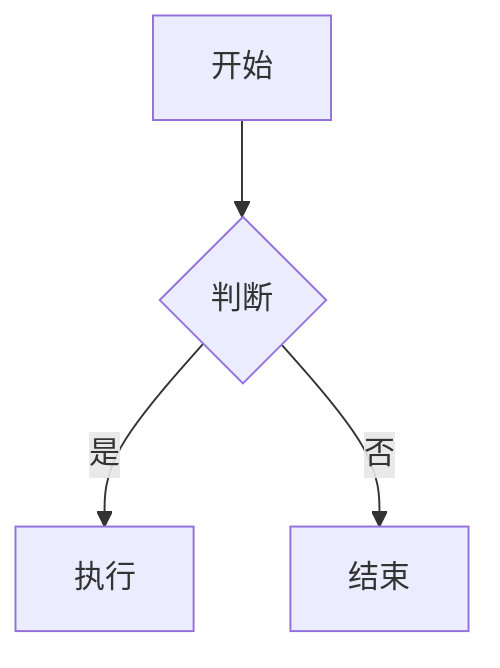
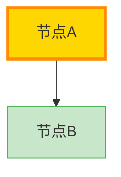

# Jupyter Notebook 中使用 Mermaid 流程图

## ✅ 支持情况

**JupyterLab** 原生支持 Mermaid 流程图，无需安装额外扩展！

在 Markdown 单元格中直接使用即可：

```markdown

```

## 📝 使用方法

### 1. 在 Markdown 单元格中使用

直接在 Markdown 单元格中编写 Mermaid 代码块：

```markdown
## 流程图示例


```

### 2. 支持的图表类型

| 类型 | 语法 | 说明 |
|------|------|------|
| **流程图** | `flowchart TB` | 最常用，支持多种方向 |
| **序列图** | `sequenceDiagram` | 时序交互图 |
| **甘特图** | `gantt` | 项目进度图 |
| **类图** | `classDiagram` | UML类图 |
| **状态图** | `stateDiagram-v2` | 状态转换图 |
| **饼图** | `pie` | 数据占比图 |

### 3. 流程图方向

```mermaid
flowchart TB    # Top to Bottom (从上到下)
flowchart LR    # Left to Right (从左到右)
flowchart BT    # Bottom to Top (从下到上)
flowchart RL    # Right to Left (从右到左)
```

### 4. 样式定制



## 🔍 在 Notebook 中查看

1. 打开 JupyterLab
2. 运行包含 Mermaid 代码的 Markdown 单元格
3. 流程图会自动渲染显示

## ⚠️ 注意事项

- **JupyterLab** 支持，但 **Jupyter Notebook** (经典版) 可能不支持
- 如果流程图不显示，确保使用的是 JupyterLab
- 复杂的流程图可能需要较长时间渲染

## 📚 参考资源

- [Mermaid 官方文档](https://mermaid.js.org/)
- [Mermaid 在线编辑器](https://mermaid.live/)
